# ocr-verification-sample
The OCR verification image is stored here.

- [ocr-verification-sample](#ocr-verification-sample)
  - [Insurance card image sample.](#insurance-card-image-sample)
  - [Driver's license image sample.](#drivers-license-image-sample)
  - [My number card image sample.](#my-number-card-image-sample)
  - [Author](#author)
  - [License](#license)

## Insurance card image sample.
<table>
  <thead>
    <tr>
      <th>項番</th>
      <th>画像名</th>
      <th>画像</th>
      <th>解像度</th>
      <th>説明</th>
      <th>余白</th>
      <th>回転</th>
      <th>背景</th>
    </tr>
  </thead>
  <tbody>
    <tr>
      <td>1</td>
      <td>保険証_001.jpg</td>
      <td>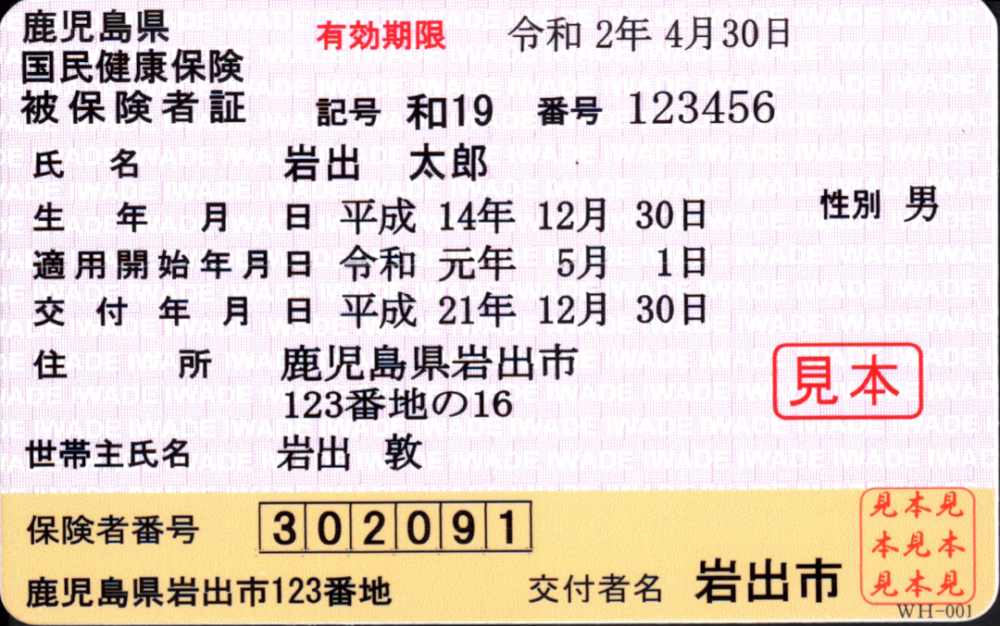</td>
      <td>1080x677</td>
      <td>カード型保険証</td>
      <td>なし</td>
      <td>なし</td>
      <td>なし</td>
    </tr>
    <tr>
      <td>2</td>
      <td>保険証_002.jpg</td>
      <td>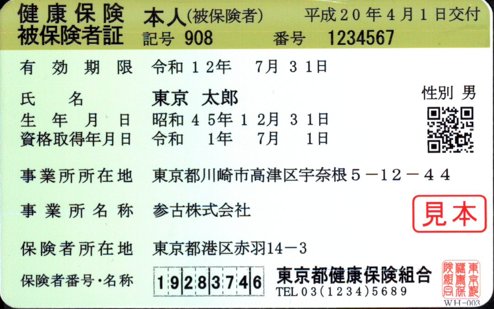</td>
      <td>1080x677</td>
      <td>カード型保険証</td>
      <td>なし</td>
      <td>なし</td>
      <td>なし</td>
    </tr>
    <tr>
      <td>3</td>
      <td>保険証_003.jpg</td>
      <td>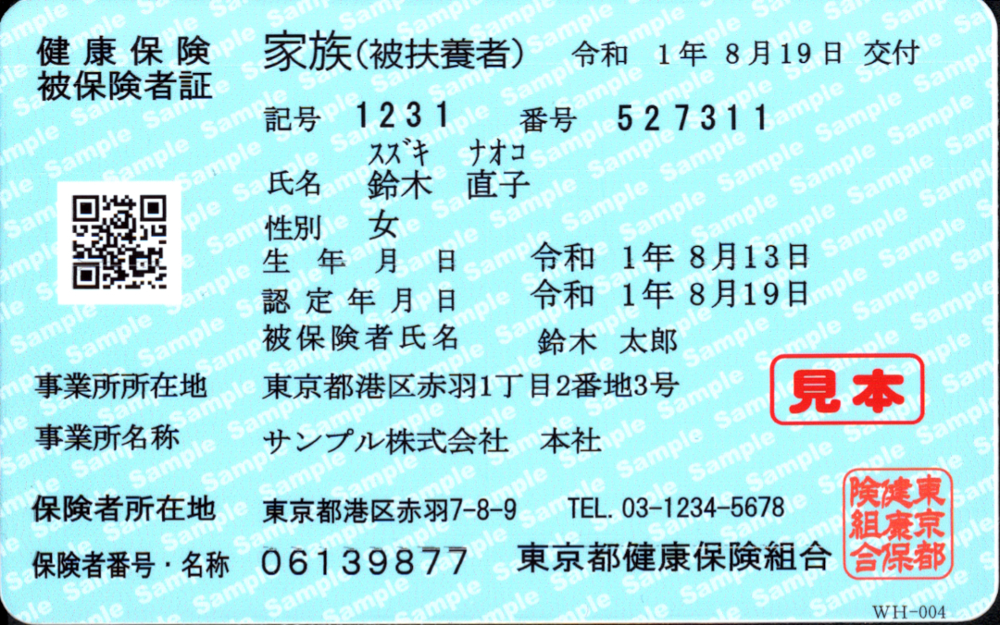</td>
      <td>1080x676</td>
      <td>カード型保険証</td>
      <td>なし</td>
      <td>なし</td>
      <td>なし</td>
    </tr>
    <tr>
      <td>4</td>
      <td>保険証_004.jpg</td>
      <td>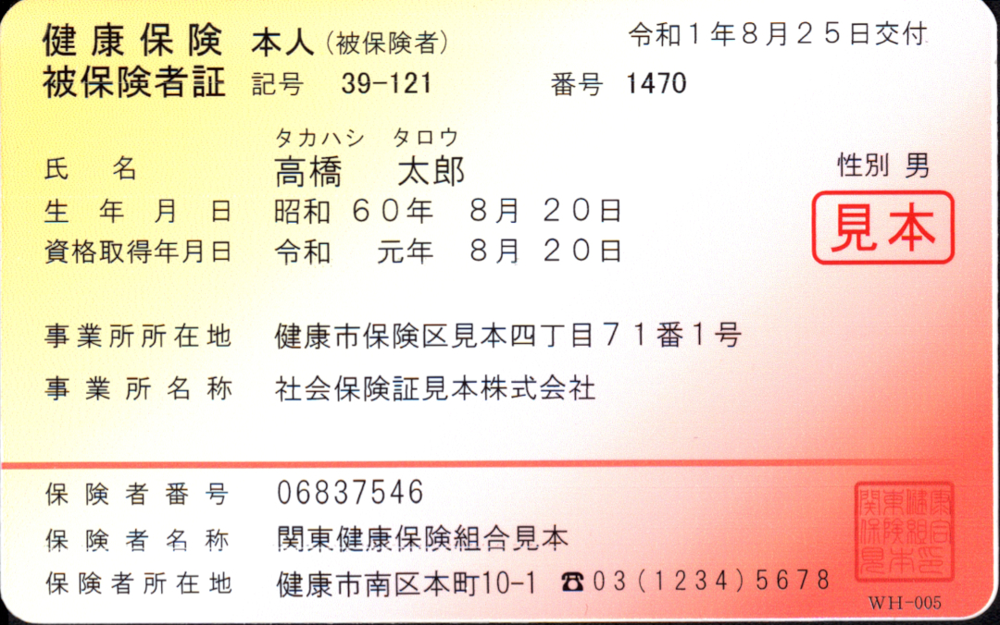</td>
      <td>1080x676</td>
      <td>カード型保険証</td>
      <td>なし</td>
      <td>なし</td>
      <td>なし</td>
    </tr>
    <tr>
      <td>5</td>
      <td>保険証_005.jpg</td>
      <td>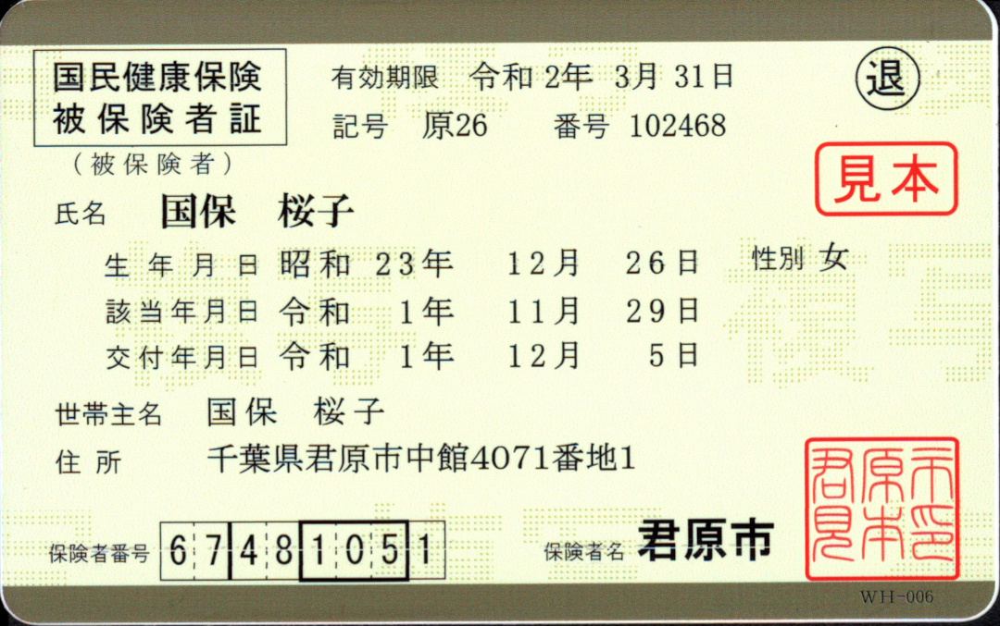</td>
      <td>1080x676</td>
      <td>カード型保険証</td>
      <td>なし</td>
      <td>なし</td>
      <td>なし</td>
    </tr>
    <tr>
      <td>6</td>
      <td>保険証_006.jpg</td>
      <td>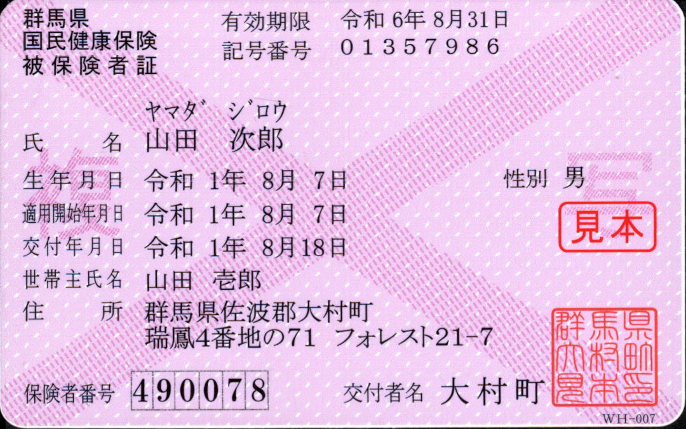</td>
      <td>1080x677</td>
      <td>カード型保険証</td>
      <td>なし</td>
      <td>なし</td>
      <td>なし</td>
    </tr>
    <tr>
      <td>7</td>
      <td>保険証_007.jpg</td>
      <td>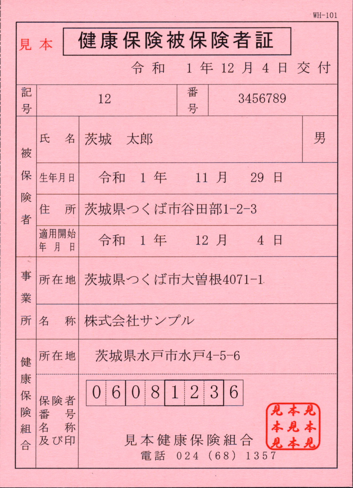</td>
      <td>1080x1492</td>
      <td>紙タイプ保険証</td>
      <td>なし</td>
      <td>なし</td>
      <td>なし</td>
    </tr>
    <tr>
      <td>8</td>
      <td>保険証_008.jpg</td>
      <td></td>
      <td>1080x1488</td>
      <td>後期高齢者医療被保険者証</td>
      <td>なし</td>
      <td>なし</td>
      <td>なし</td>
    </tr>
    <tr>
      <td>9</td>
      <td>保険証_009.jpg</td>
      <td>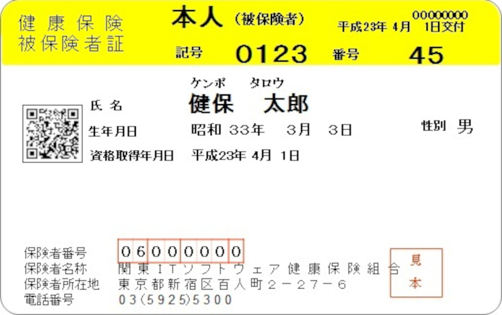</td>
      <td>1080x680</td>
      <td>カード型保険証（関東ITソフトウェア健康保険組合）</td>
      <td>なし</td>
      <td>なし</td>
      <td>なし</td>
    </tr>
    <tr>
      <td>10</td>
      <td>受給者証_001.jpg</td>
      <td>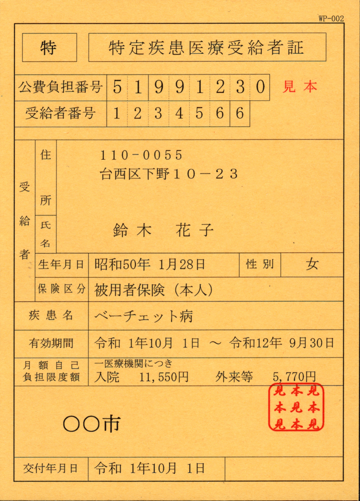</td>
      <td>1080x1500</td>
      <td>特定疾患医療受給者証</td>
      <td>なし</td>
      <td>なし</td>
      <td>なし</td>
    </tr>
    <tr>
      <td>11</td>
      <td>受給者証_002.jpg</td>
      <td>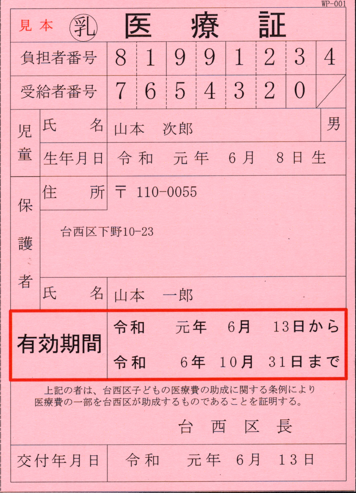</td>
      <td>1080x1493</td>
      <td>乳幼児医療証</td>
      <td>なし</td>
      <td>なし</td>
      <td>なし</td>
    </tr>
    <tr>
      <td>12</td>
      <td>保険証_001_margin-vh_bg-gray.jpg</td>
      <td>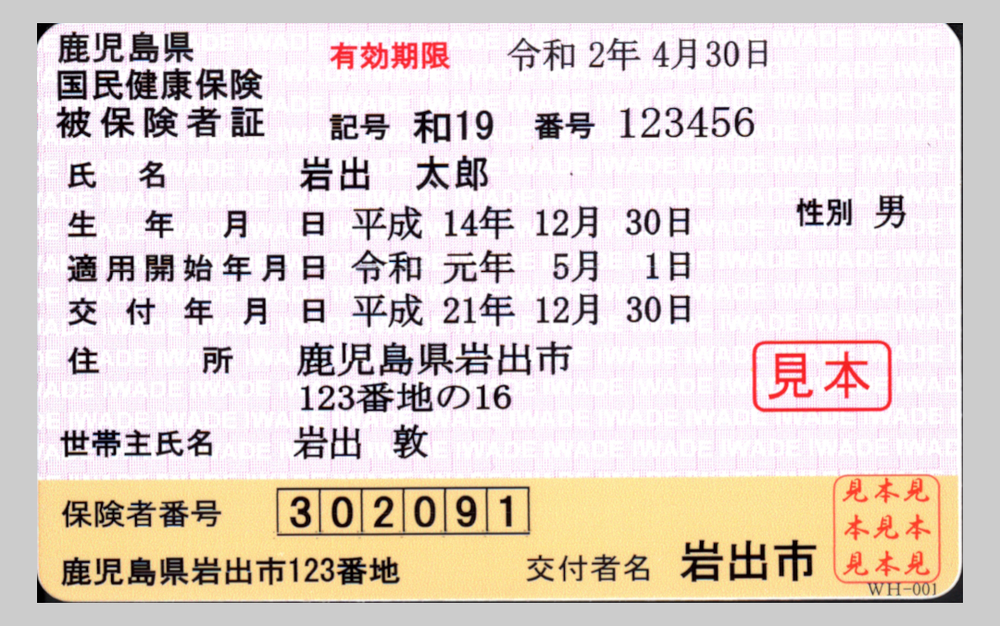</td>
      <td>1080x677</td>
      <td>カード型保険証</td>
      <td>縦横</td>
      <td>なし</td>
      <td>灰</td>
    </tr>
    <tr>
      <td>13</td>
      <td>保険証_002_margin-vh_bg-gray.jpg</td>
      <td>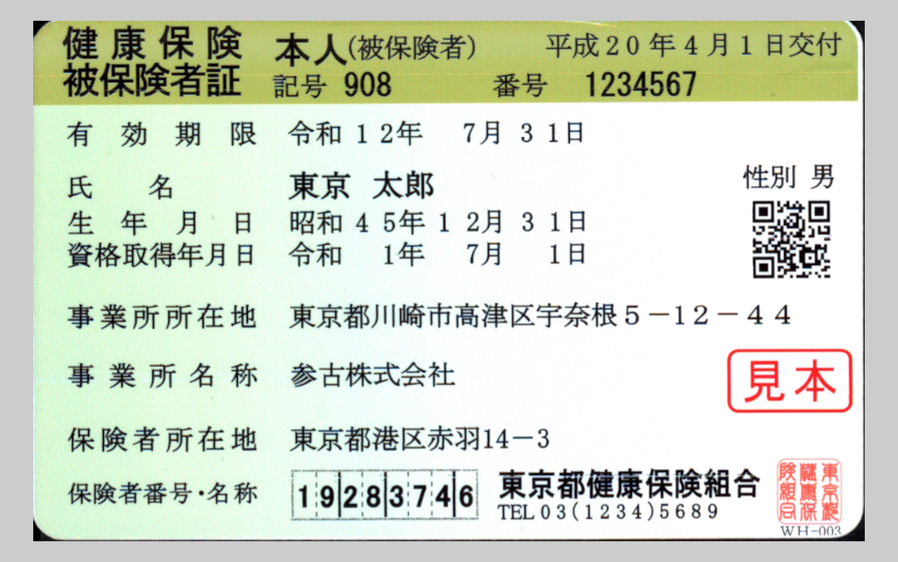</td>
      <td>1080x677</td>
      <td>カード型保険証</td>
      <td>縦横</td>
      <td>なし</td>
      <td>灰</td>
    </tr>
    <tr>
      <td>14</td>
      <td>保険証_003_margin-vh_bg-gray.jpg</td>
      <td>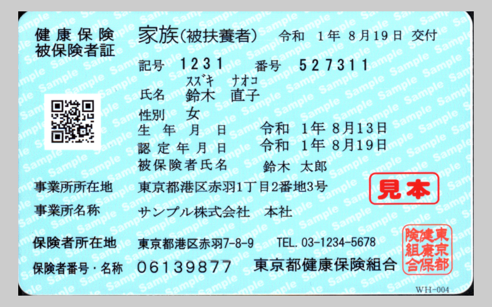</td>
      <td>1080x676</td>
      <td>カード型保険証</td>
      <td>縦横</td>
      <td>なし</td>
      <td>灰</td>
    </tr>
    <tr>
      <td>15</td>
      <td>保険証_004_margin-vh_bg-gray.jpg</td>
      <td>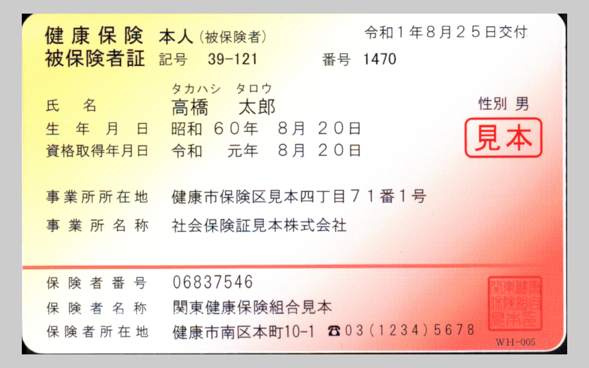</td>
      <td>1080x676</td>
      <td>カード型保険証</td>
      <td>縦横</td>
      <td>なし</td>
      <td>灰</td>
    </tr>
    <tr>
      <td>16</td>
      <td>保険証_005_margin-vh_bg-gray.jpg</td>
      <td>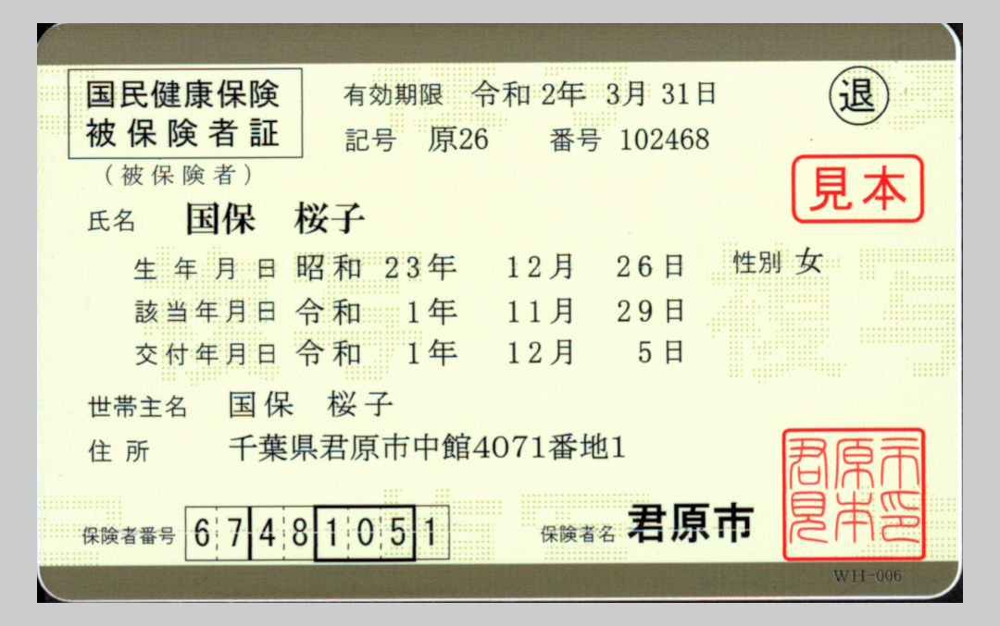</td>
      <td>1080x676</td>
      <td>カード型保険証</td>
      <td>縦横</td>
      <td>なし</td>
      <td>灰</td>
    </tr>
    <tr>
      <td>17</td>
      <td>保険証_006_margin-vh_bg-gray.jpg</td>
      <td>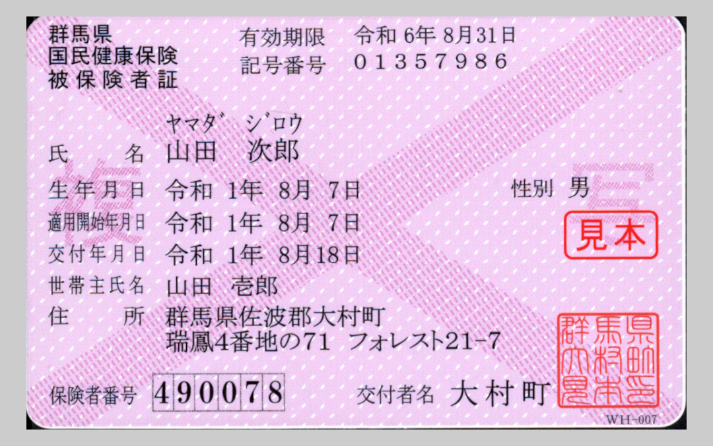</td>
      <td>1080x677</td>
      <td>カード型保険証</td>
      <td>縦横</td>
      <td>なし</td>
      <td>灰</td>
    </tr>
    <tr>
      <td>18</td>
      <td>保険証_007_margin-vh_bg-gray.jpg</td>
      <td>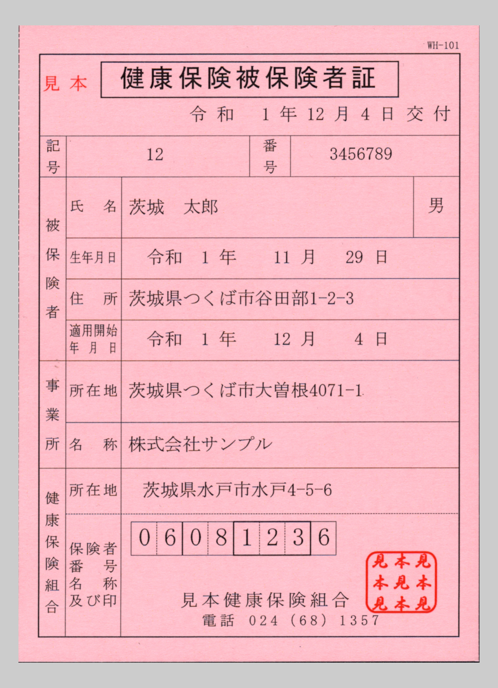</td>
      <td>1080x1491</td>
      <td>紙タイプ保険証</td>
      <td>縦横</td>
      <td>なし</td>
      <td>灰</td>
    </tr>
    <tr>
      <td>19</td>
      <td>保険証_008_margin-vh_bg-gray.jpg</td>
      <td>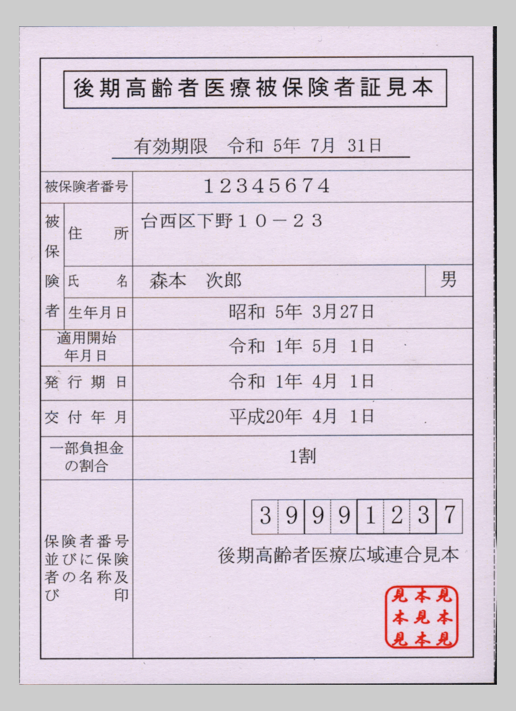</td>
      <td>1080x1488</td>
      <td>後期高齢者医療被保険者証</td>
      <td>縦横</td>
      <td>なし</td>
      <td>灰</td>
    </tr>
    <tr>
      <td>20</td>
      <td>保険証_009_margin-vh_bg-gray.jpg</td>
      <td>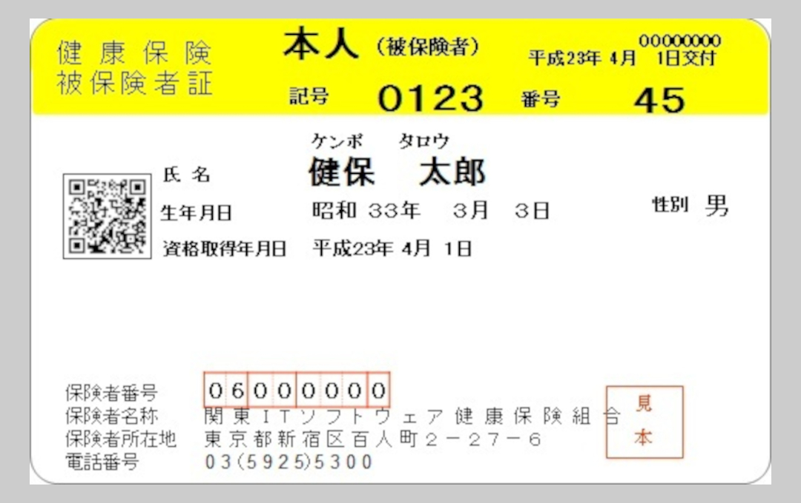</td>
      <td>1080x680</td>
      <td>カード型保険証（関東ITソフトウェア健康保険組合）</td>
      <td>縦横</td>
      <td>なし</td>
      <td>灰</td>
    </tr>
    <tr>
      <td>21</td>
      <td>受給者証_001_margin-vh_bg-gray.jpg</td>
      <td>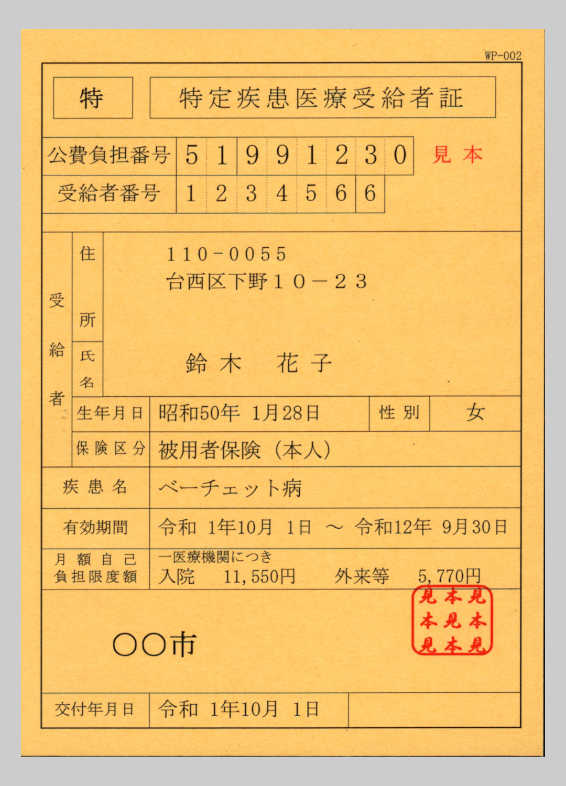</td>
      <td>1080x1500</td>
      <td>特定疾患医療受給者証</td>
      <td>縦横</td>
      <td>なし</td>
      <td>灰</td>
    </tr>
    <tr>
      <td>22</td>
      <td>受給者証_002_margin-vh_bg-gray.jpg</td>
      <td>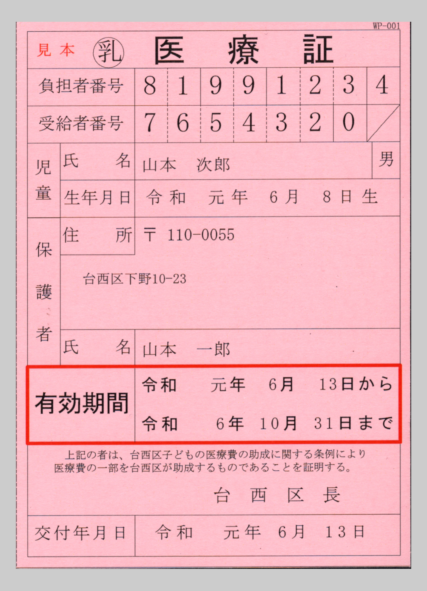</td>
      <td>1080x1493</td>
      <td>乳幼児医療証</td>
      <td>縦横</td>
      <td>なし</td>
      <td>灰</td>
    </tr>
    <tr>
      <td>23</td>
      <td>保険証_001_margin-v_bg-gray.jpg</td>
      <td>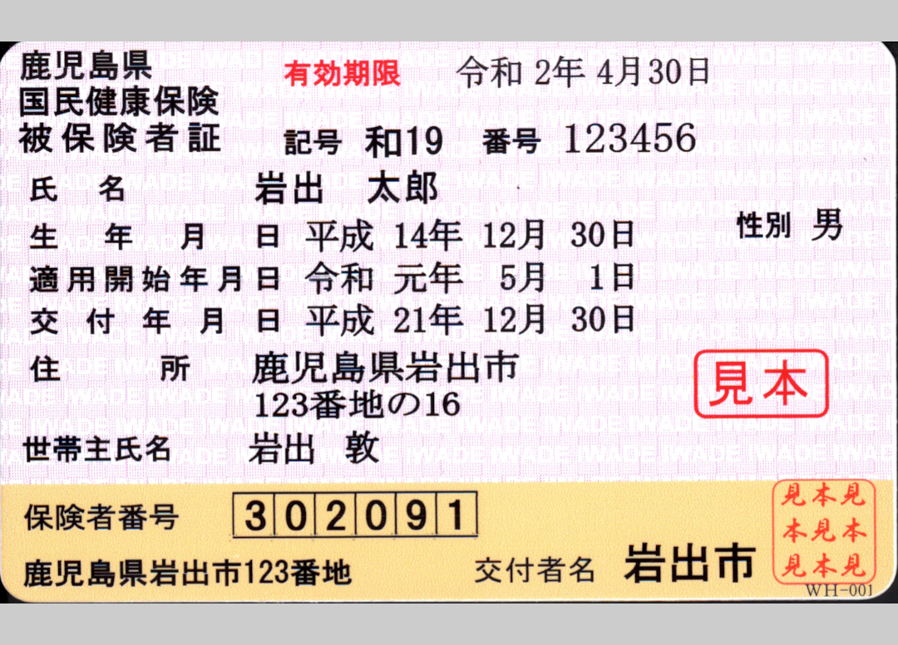</td>
      <td>1080x777</td>
      <td>カード型保険証</td>
      <td>縦</td>
      <td>なし</td>
      <td>灰</td>
    </tr>
    <tr>
      <td>24</td>
      <td>保険証_002_margin-v_bg-gray.jpg</td>
      <td>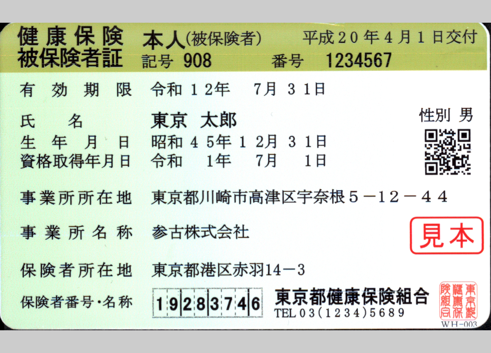</td>
      <td>1080x777</td>
      <td>カード型保険証</td>
      <td>縦</td>
      <td>なし</td>
      <td>灰</td>
    </tr>
    <tr>
      <td>25</td>
      <td>保険証_003_margin-v_bg-gray.jpg</td>
      <td>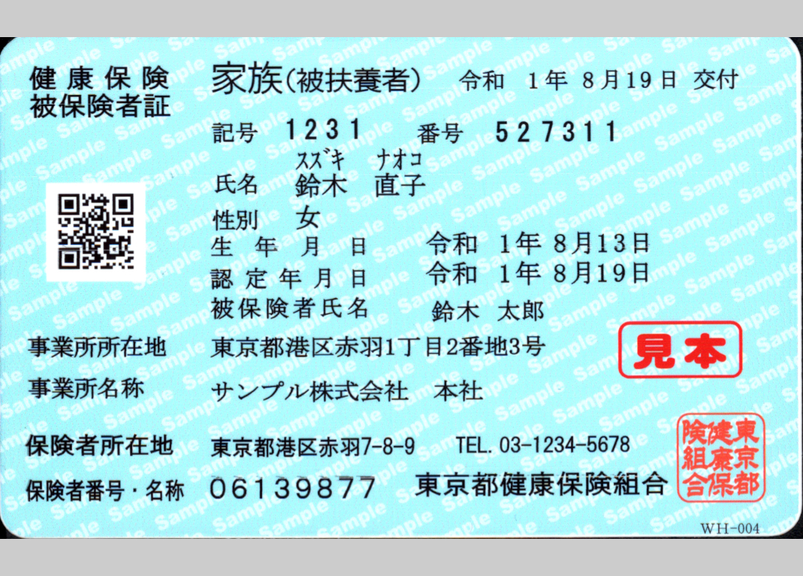</td>
      <td>1080x776</td>
      <td>カード型保険証</td>
      <td>縦</td>
      <td>なし</td>
      <td>灰</td>
    </tr>
    <tr>
      <td>26</td>
      <td>保険証_004_margin-v_bg-gray.jpg</td>
      <td>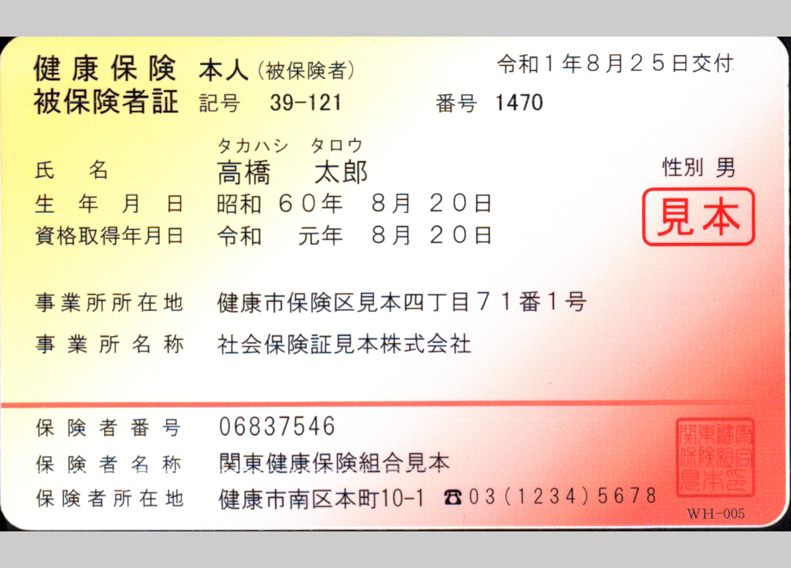</td>
      <td>1080x776</td>
      <td>カード型保険証</td>
      <td>縦</td>
      <td>なし</td>
      <td>灰</td>
    </tr>
    <tr>
      <td>27</td>
      <td>保険証_005_margin-v_bg-gray.jpg</td>
      <td>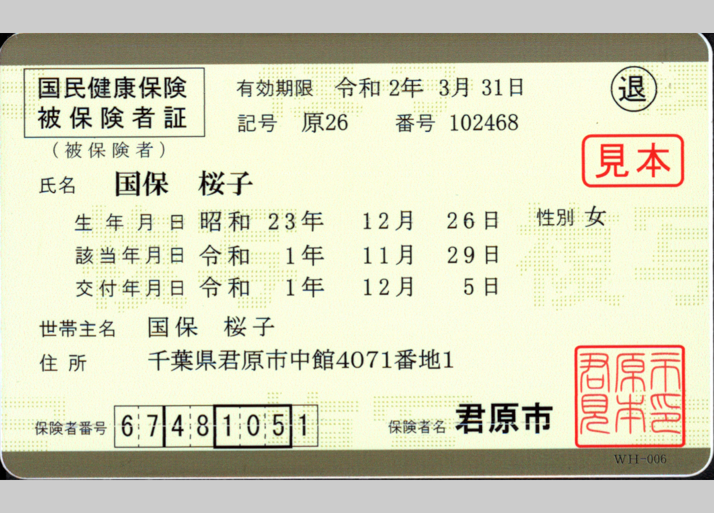</td>
      <td>1080x776</td>
      <td>カード型保険証</td>
      <td>縦</td>
      <td>なし</td>
      <td>灰</td>
    </tr>
    <tr>
      <td>28</td>
      <td>保険証_006_margin-v_bg-gray.jpg</td>
      <td>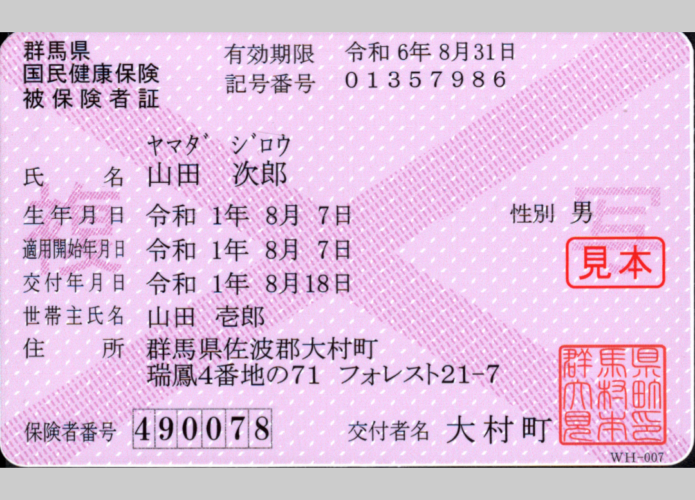</td>
      <td>1080x777</td>
      <td>カード型保険証</td>
      <td>縦</td>
      <td>なし</td>
      <td>灰</td>
    </tr>
    <tr>
      <td>29</td>
      <td>保険証_007_margin-v_bg-gray.jpg</td>
      <td>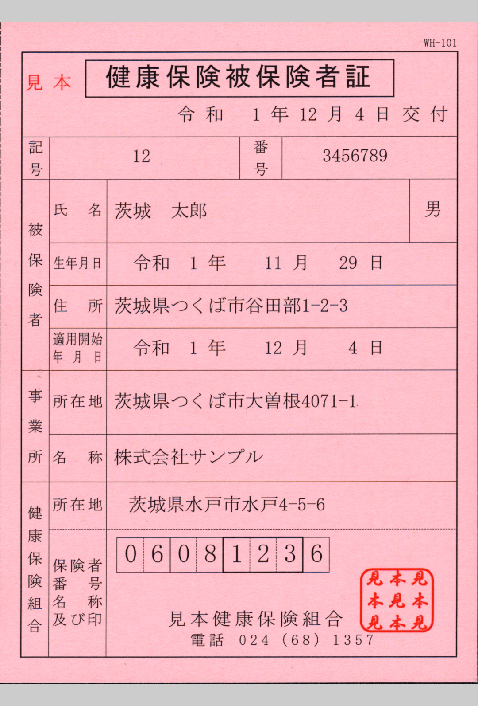</td>
      <td>1080x1592</td>
      <td>紙タイプ保険証</td>
      <td>縦</td>
      <td>なし</td>
      <td>灰</td>
    </tr>
    <tr>
      <td>30</td>
      <td>保険証_008_margin-v_bg-gray.jpg</td>
      <td>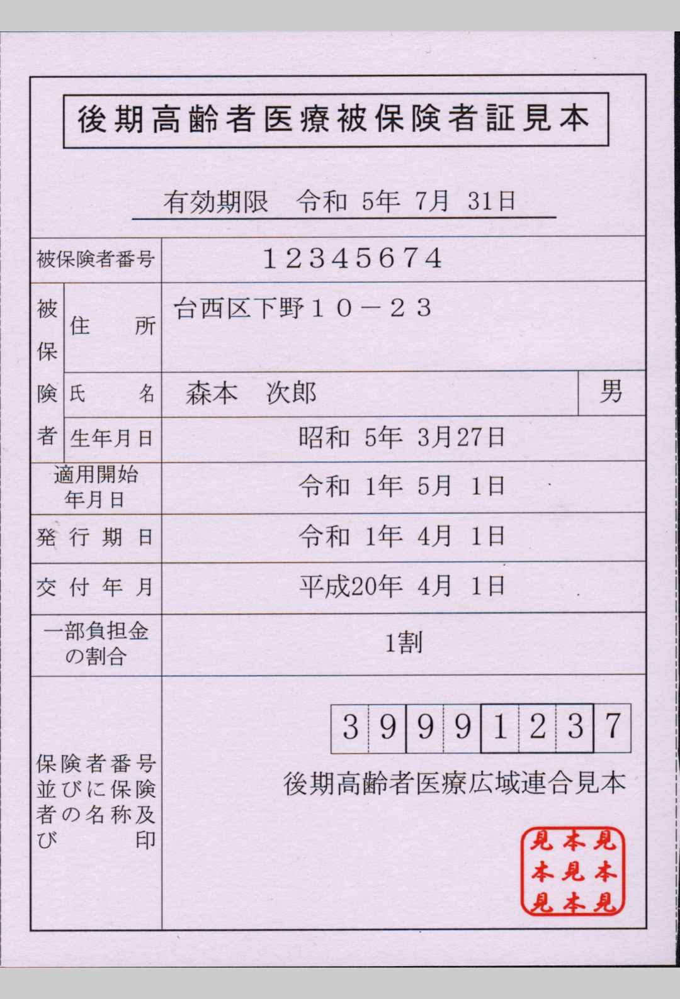</td>
      <td>1080x1588</td>
      <td>後期高齢者医療被保険者証</td>
      <td>縦</td>
      <td>なし</td>
      <td>灰</td>
    </tr>
    <tr>
      <td>31</td>
      <td>保険証_009_margin-v_bg-gray.jpg</td>
      <td>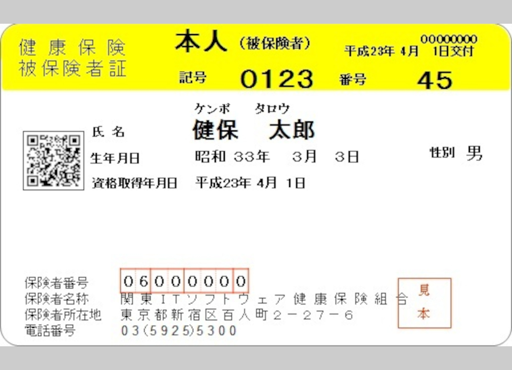</td>
      <td>1080x780</td>
      <td>カード型保険証（関東ITソフトウェア健康保険組合）</td>
      <td>縦</td>
      <td>なし</td>
      <td>灰</td>
    </tr>
    <tr>
      <td>32</td>
      <td>受給者証_001_margin-v_bg-gray.jpg</td>
      <td>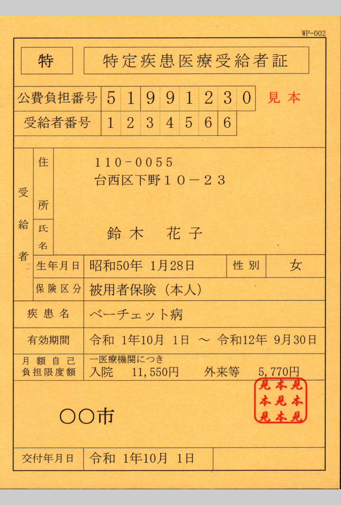</td>
      <td>1080x1600</td>
      <td>特定疾患医療受給者証</td>
      <td>縦</td>
      <td>なし</td>
      <td>灰</td>
    </tr>
    <tr>
      <td>33</td>
      <td>受給者証_002_margin-v_bg-gray.jpg</td>
      <td>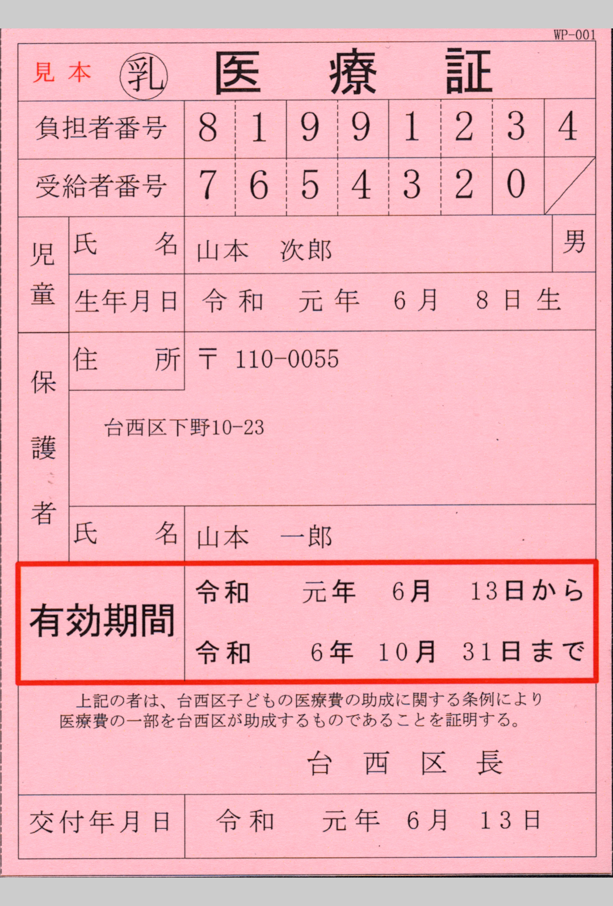</td>
      <td>1080x1593</td>
      <td>乳幼児医療証</td>
      <td>縦</td>
      <td>なし</td>
      <td>灰</td>
    </tr>
    <tr>
      <td>34</td>
      <td>保険証_001_margin-h_bg-gray.jpg</td>
      <td>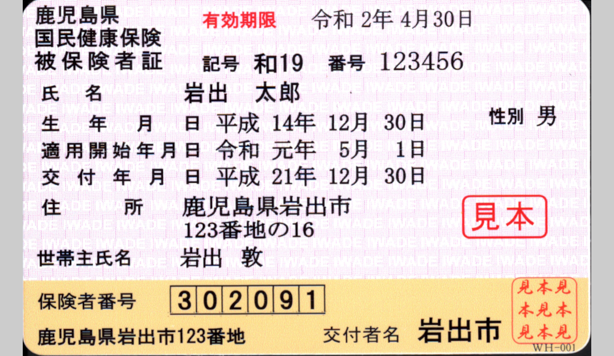</td>
      <td>1080x627</td>
      <td>カード型保険証</td>
      <td>横</td>
      <td>なし</td>
      <td>灰</td>
    </tr>
    <tr>
      <td>35</td>
      <td>保険証_002_margin-h_bg-gray.jpg</td>
      <td>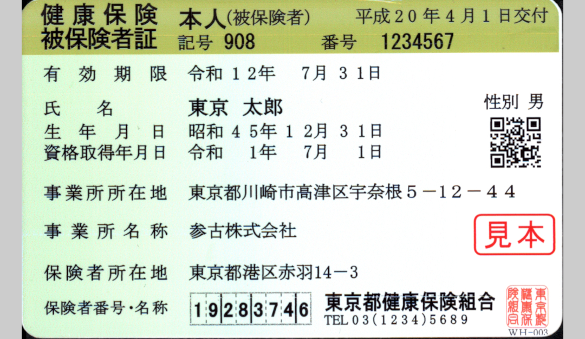</td>
      <td>1080x627</td>
      <td>カード型保険証</td>
      <td>横</td>
      <td>なし</td>
      <td>灰</td>
    </tr>
    <tr>
      <td>36</td>
      <td>保険証_003_margin-h_bg-gray.jpg</td>
      <td>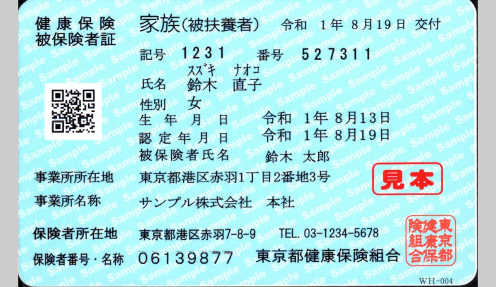</td>
      <td>1080x626</td>
      <td>カード型保険証</td>
      <td>横</td>
      <td>なし</td>
      <td>灰</td>
    </tr>
    <tr>
      <td>37</td>
      <td>保険証_004_margin-h_bg-gray.jpg</td>
      <td>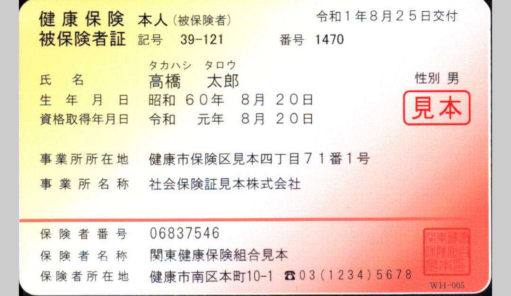</td>
      <td>1080x626</td>
      <td>カード型保険証</td>
      <td>横</td>
      <td>なし</td>
      <td>灰</td>
    </tr>
    <tr>
      <td>38</td>
      <td>保険証_005_margin-h_bg-gray.jpg</td>
      <td>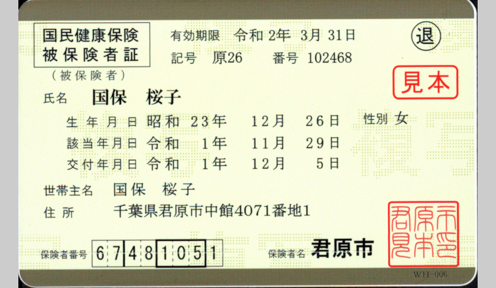</td>
      <td>1080x627</td>
      <td>カード型保険証</td>
      <td>横</td>
      <td>なし</td>
      <td>灰</td>
    </tr>
    <tr>
      <td>39</td>
      <td>保険証_006_margin-h_bg-gray.jpg</td>
      <td>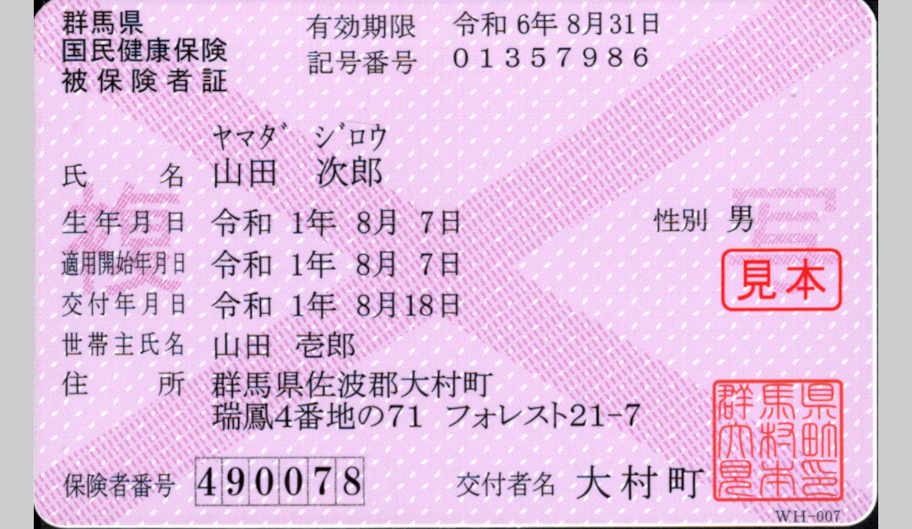</td>
      <td>1080x627</td>
      <td>カード型保険証</td>
      <td>横</td>
      <td>なし</td>
      <td>灰</td>
    </tr>
    <tr>
      <td>40</td>
      <td>保険証_007_margin-h_bg-gray.jpg</td>
      <td>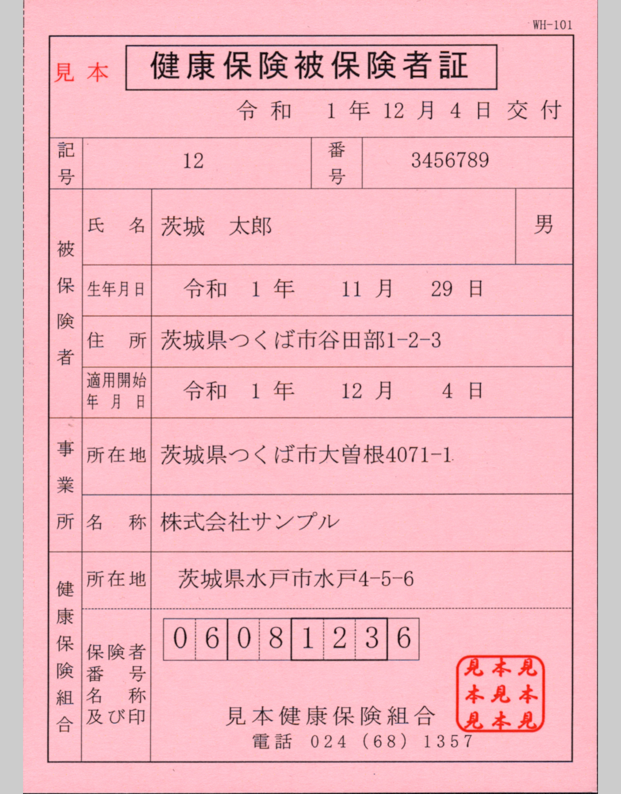</td>
      <td>1080x1381</td>
      <td>紙タイプ保険証</td>
      <td>横</td>
      <td>なし</td>
      <td>灰</td>
    </tr>
    <tr>
      <td>41</td>
      <td>保険証_008_margin-h_bg-gray.jpg</td>
      <td>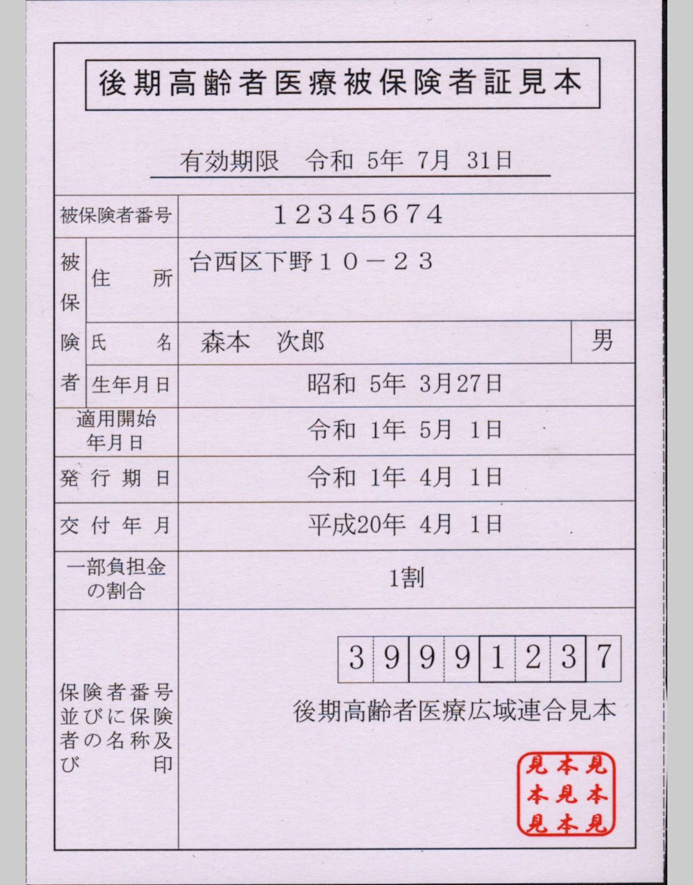</td>
      <td>1080x1378</td>
      <td>後期高齢者医療被保険者証</td>
      <td>横</td>
      <td>なし</td>
      <td>灰</td>
    </tr>
    <tr>
      <td>42</td>
      <td>保険証_009_margin-h_bg-gray.jpg</td>
      <td>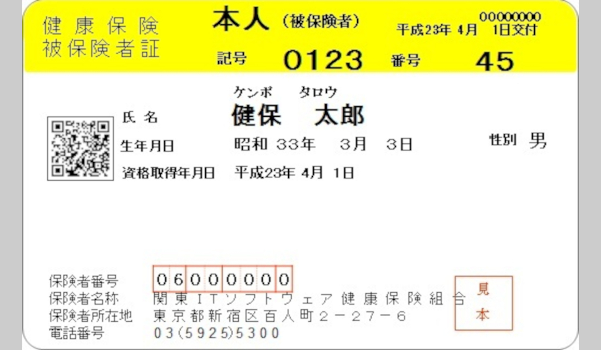</td>
      <td>1080x630</td>
      <td>カード型保険証（関東ITソフトウェア健康保険組合）</td>
      <td>横</td>
      <td>なし</td>
      <td>灰</td>
    </tr>
    <tr>
      <td>43</td>
      <td>受給者証_001_margin-h_bg-gray.jpg</td>
      <td>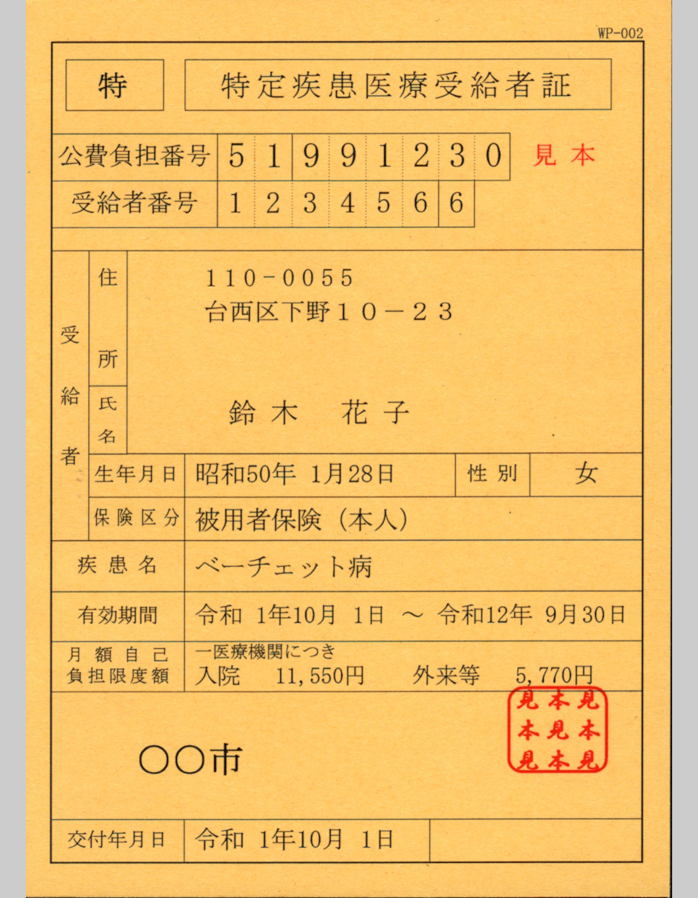</td>
      <td>1080x1389</td>
      <td>特定疾患医療受給者証</td>
      <td>横</td>
      <td>なし</td>
      <td>灰</td>
    </tr>
    <tr>
      <td>44</td>
      <td>受給者証_002_margin-h_bg-gray.jpg</td>
      <td>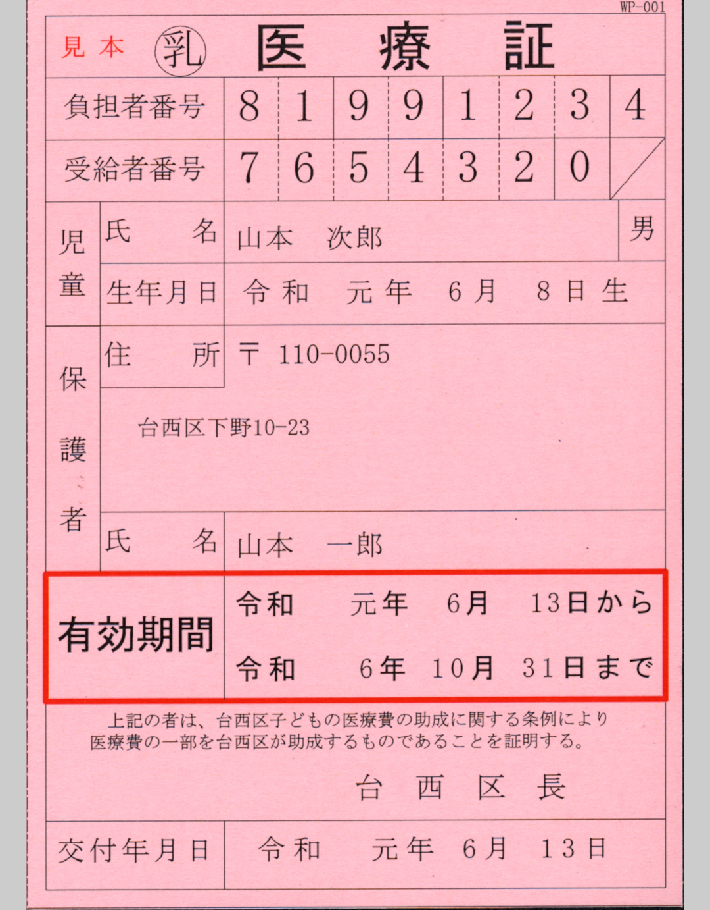</td>
      <td>1080x1382</td>
      <td>乳幼児医療証</td>
      <td>横</td>
      <td>なし</td>
      <td>灰</td>
    </tr>
    <tr>
      <td>45</td>
      <td>保険証_001_rotation-x-30_bg-gray.jpg</td>
      <td>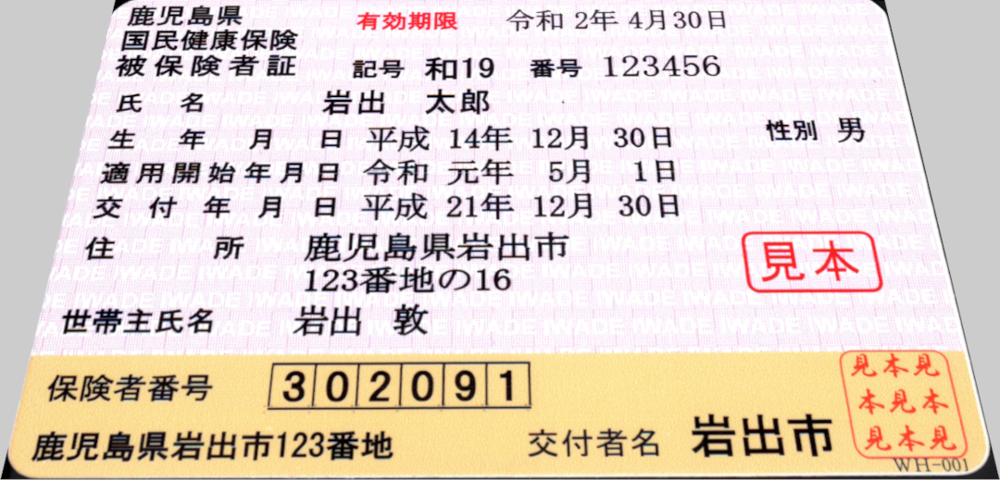</td>
      <td>1080x677</td>
      <td>カード型保険証</td>
      <td>なし</td>
      <td>X軸30°</td>
      <td>灰</td>
    </tr>
    <tr>
      <td>46</td>
      <td>保険証_002_rotation-x-30_bg-gray.jpg</td>
      <td>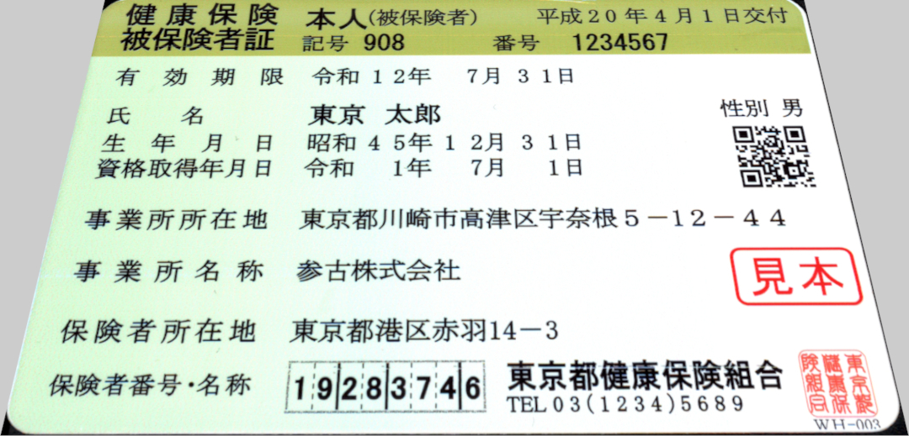</td>
      <td>1080x677</td>
      <td>カード型保険証</td>
      <td>なし</td>
      <td>X軸30°</td>
      <td>灰</td>
    </tr>
    <tr>
      <td>47</td>
      <td>保険証_003_rotation-x-30_bg-gray.jpg</td>
      <td>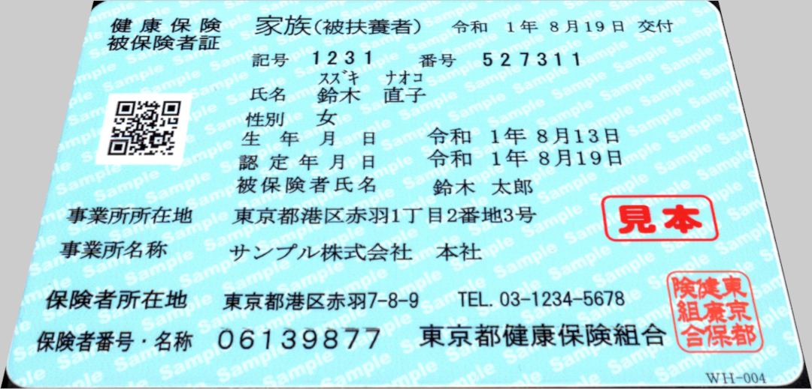</td>
      <td>1080x676</td>
      <td>カード型保険証</td>
      <td>なし</td>
      <td>X軸30°</td>
      <td>灰</td>
    </tr>
    <tr>
      <td>48</td>
      <td>保険証_004_rotation-x-30_bg-gray.jpg</td>
      <td>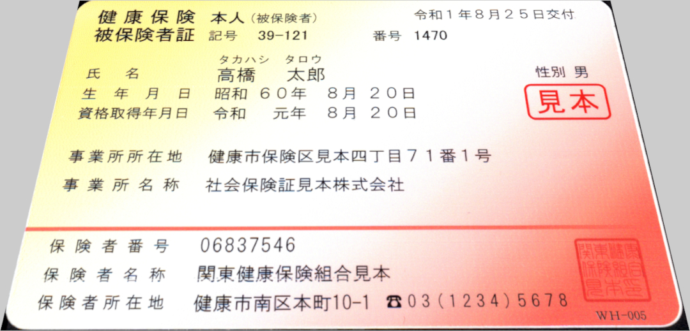</td>
      <td>1080x676</td>
      <td>カード型保険証</td>
      <td>なし</td>
      <td>X軸30°</td>
      <td>灰</td>
    </tr>
    <tr>
      <td>49</td>
      <td>保険証_005_rotation-x-30_bg-gray.jpg</td>
      <td>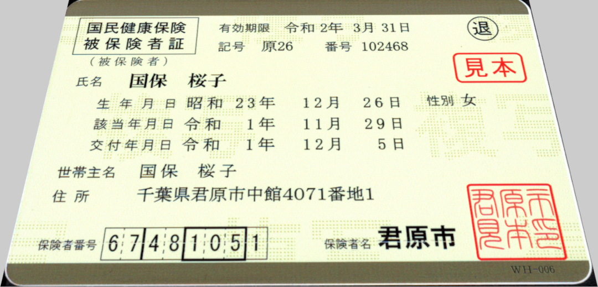</td>
      <td>1080x676</td>
      <td>カード型保険証</td>
      <td>なし</td>
      <td>X軸30°</td>
      <td>灰</td>
    </tr>
    <tr>
      <td>50</td>
      <td>保険証_006_rotation-x-30_bg-gray.jpg</td>
      <td>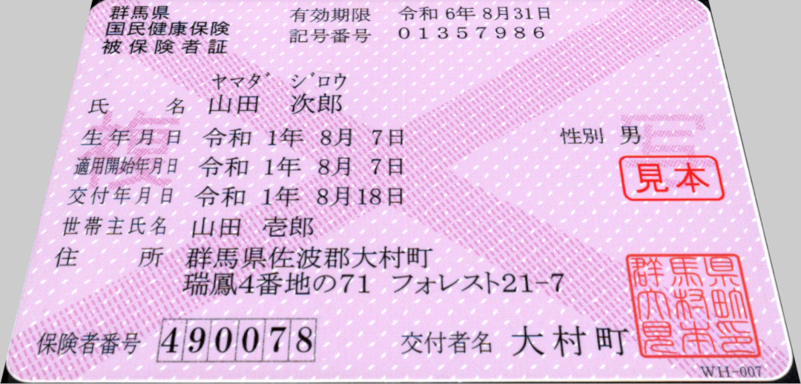</td>
      <td>1080x677</td>
      <td>カード型保険証</td>
      <td>なし</td>
      <td>X軸30°</td>
      <td>灰</td>
    </tr>
    <tr>
      <td>51</td>
      <td>保険証_007_rotation-x-30_bg-gray.jpg</td>
      <td>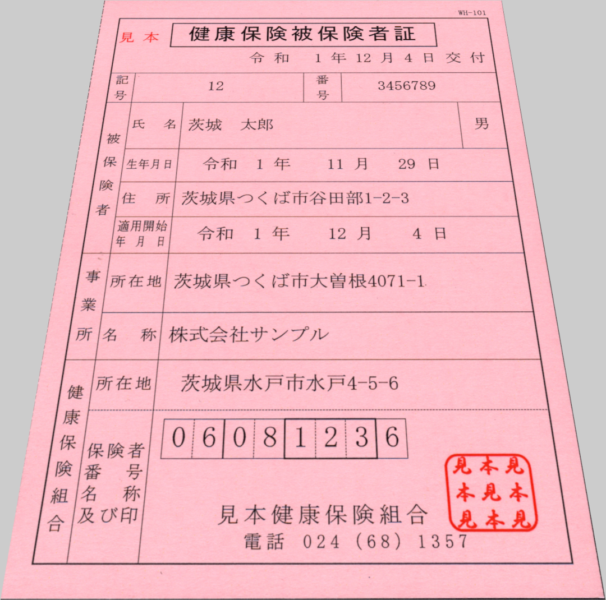</td>
      <td>1080x1492</td>
      <td>紙タイプ保険証</td>
      <td>なし</td>
      <td>X軸30°</td>
      <td>灰</td>
    </tr>
    <tr>
      <td>52</td>
      <td>保険証_008_rotation-x-30_bg-gray.jpg</td>
      <td></td>
      <td>1080x1488</td>
      <td>後期高齢者医療被保険者証</td>
      <td>なし</td>
      <td>X軸30°</td>
      <td>灰</td>
    </tr>
    <tr>
      <td>53</td>
      <td>保険証_009_rotation-x-30_bg-gray.jpg</td>
      <td></td>
      <td>1080x680</td>
      <td>カード型保険証（関東ITソフトウェア健康保険組合）</td>
      <td>なし</td>
      <td>X軸30°</td>
      <td>灰</td>
    </tr>
    <tr>
      <td>54</td>
      <td>受給者証_001_rotation-x-30_bg-gray.jpg</td>
      <td></td>
      <td>1080x1500</td>
      <td>特定疾患医療受給者証</td>
      <td>なし</td>
      <td>X軸30°</td>
      <td>灰</td>
    </tr>
    <tr>
      <td>55</td>
      <td>受給者証_002_rotation-x-30_bg-gray.jpg</td>
      <td></td>
      <td>1080x1493</td>
      <td>乳幼児医療証</td>
      <td>なし</td>
      <td>X軸30°</td>
      <td>灰</td>
    </tr>
    <tr>
      <td>56</td>
      <td>保険証_001_rotation-y-30_bg-gray.jpg</td>
      <td></td>
      <td>1080x944</td>
      <td>カード型保険証</td>
      <td>なし</td>
      <td>Y軸30°</td>
      <td>灰</td>
    </tr>
    <tr>
      <td>57</td>
      <td>保険証_002_rotation-y-30_bg-gray.jpg</td>
      <td></td>
      <td>1080x944</td>
      <td>カード型保険証</td>
      <td>なし</td>
      <td>Y軸30°</td>
      <td>灰</td>
    </tr>
    <tr>
      <td>58</td>
      <td>保険証_003_rotation-y-30_bg-gray.jpg</td>
      <td></td>
      <td>1080x943</td>
      <td>カード型保険証</td>
      <td>なし</td>
      <td>Y軸30°</td>
      <td>灰</td>
    </tr>
    <tr>
      <td>59</td>
      <td>保険証_004_rotation-y-30_bg-gray.jpg</td>
      <td></td>
      <td>1080x943</td>
      <td>カード型保険証</td>
      <td>なし</td>
      <td>Y軸30°</td>
      <td>灰</td>
    </tr>
    <tr>
      <td>60</td>
      <td>保険証_005_rotation-y-30_bg-gray.jpg</td>
      <td></td>
      <td>1080x944</td>
      <td>カード型保険証</td>
      <td>なし</td>
      <td>Y軸30°</td>
      <td>灰</td>
    </tr>
    <tr>
      <td>61</td>
      <td>保険証_006_rotation-y-30_bg-gray.jpg</td>
      <td></td>
      <td>1080x944</td>
      <td>カード型保険証</td>
      <td>なし</td>
      <td>Y軸30°</td>
      <td>灰</td>
    </tr>
    <tr>
      <td>62</td>
      <td>保険証_007_rotation-y-30_bg-gray.jpg</td>
      <td></td>
      <td>1080x1980</td>
      <td>紙タイプ保険証</td>
      <td>なし</td>
      <td>Y軸30°</td>
      <td>灰</td>
    </tr>
    <tr>
      <td>63</td>
      <td>保険証_008_rotation-y-30_bg-gray.jpg</td>
      <td></td>
      <td>1080x1975</td>
      <td>後期高齢者医療被保険者証</td>
      <td>なし</td>
      <td>Y軸30°</td>
      <td>灰</td>
    </tr>
    <tr>
      <td>64</td>
      <td>保険証_009_rotation-y-30_bg-gray.jpg</td>
      <td></td>
      <td>1080x947</td>
      <td>カード型保険証（関東ITソフトウェア健康保険組合）</td>
      <td>なし</td>
      <td>Y軸30°</td>
      <td>灰</td>
    </tr>
    <tr>
      <td>65</td>
      <td>受給者証_001_rotation-y-30_bg-gray.jpg</td>
      <td></td>
      <td>1080x1991</td>
      <td>特定疾患医療受給者証</td>
      <td>なし</td>
      <td>Y軸30°</td>
      <td>灰</td>
    </tr>
    <tr>
      <td>66</td>
      <td>受給者証_002_rotation-y-30_bg-gray.jpg</td>
      <td></td>
      <td>1080x1981</td>
      <td>乳幼児医療証</td>
      <td>なし</td>
      <td>Y軸30°</td>
      <td>灰</td>
    </tr>
    <tr>
      <td>67</td>
      <td>保険証_001_rotation-z-30_bg-gray.jpg</td>
      <td></td>
      <td>1080x677</td>
      <td>カード型保険証</td>
      <td>なし</td>
      <td>Z軸30°</td>
      <td>灰</td>
    </tr>
    <tr>
      <td>68</td>
      <td>保険証_002_rotation-z-30_bg-gray.jpg</td>
      <td></td>
      <td>1080x677</td>
      <td>カード型保険証</td>
      <td>なし</td>
      <td>Z軸30°</td>
      <td>灰</td>
    </tr>
    <tr>
      <td>69</td>
      <td>保険証_003_rotation-z-30_bg-gray.jpg</td>
      <td></td>
      <td>1080x676</td>
      <td>カード型保険証</td>
      <td>なし</td>
      <td>Z軸30°</td>
      <td>灰</td>
    </tr>
    <tr>
      <td>70</td>
      <td>保険証_004_rotation-z-30_bg-gray.jpg</td>
      <td></td>
      <td>1080x676</td>
      <td>カード型保険証</td>
      <td>なし</td>
      <td>Z軸30°</td>
      <td>灰</td>
    </tr>
    <tr>
      <td>71</td>
      <td>保険証_005_rotation-z-30_bg-gray.jpg</td>
      <td></td>
      <td>1080x676</td>
      <td>カード型保険証</td>
      <td>なし</td>
      <td>Z軸30°</td>
      <td>灰</td>
    </tr>
    <tr>
      <td>72</td>
      <td>保険証_006_rotation-z-30_bg-gray.jpg</td>
      <td></td>
      <td>1080x677</td>
      <td>カード型保険証</td>
      <td>なし</td>
      <td>Z軸30°</td>
      <td>灰</td>
    </tr>
    <tr>
      <td>73</td>
      <td>保険証_007_rotation-z-30_bg-gray.jpg</td>
      <td></td>
      <td>1080x1492</td>
      <td>紙タイプ保険証</td>
      <td>なし</td>
      <td>Z軸30°</td>
      <td>灰</td>
    </tr>
    <tr>
      <td>74</td>
      <td>保険証_008_rotation-z-30_bg-gray.jpg</td>
      <td></td>
      <td>1080x1488</td>
      <td>後期高齢者医療被保険者証</td>
      <td>なし</td>
      <td>Z軸30°</td>
      <td>灰</td>
    </tr>
    <tr>
      <td>75</td>
      <td>保険証_009_rotation-z-30_bg-gray.jpg</td>
      <td></td>
      <td>1080x680</td>
      <td>カード型保険証（関東ITソフトウェア健康保険組合）</td>
      <td>なし</td>
      <td>Z軸30°</td>
      <td>灰</td>
    </tr>
    <tr>
      <td>76</td>
      <td>受給者証_001_rotation-z-30_bg-gray.jpg</td>
      <td></td>
      <td>1080x1500</td>
      <td>特定疾患医療受給者証</td>
      <td>なし</td>
      <td>Z軸30°</td>
      <td>灰</td>
    </tr>
    <tr>
      <td>77</td>
      <td>受給者証_002_rotation-z-30_bg-gray.jpg</td>
      <td></td>
      <td>1080x1493</td>
      <td>乳幼児医療証</td>
      <td>なし</td>
      <td>Z軸30°</td>
      <td>灰</td>
    </tr>
    <tr>
      <td>78</td>
      <td>保険証_001_margin-vh_rotation-x-30_bg-gray.jpg</td>
      <td></td>
      <td>1080x519</td>
      <td>カード型保険証</td>
      <td>縦横</td>
      <td>X軸30°</td>
      <td>灰</td>
    </tr>
    <tr>
      <td>79</td>
      <td>保険証_002_margin-vh_rotation-x-30_bg-gray.jpg</td>
      <td></td>
      <td>1080x519</td>
      <td>カード型保険証</td>
      <td>縦横</td>
      <td>X軸30°</td>
      <td>灰</td>
    </tr>
    <tr>
      <td>80</td>
      <td>保険証_003_margin-vh_rotation-x-30_bg-gray.jpg</td>
      <td></td>
      <td>1080x519</td>
      <td>カード型保険証</td>
      <td>縦横</td>
      <td>X軸30°</td>
      <td>灰</td>
    </tr>
    <tr>
      <td>81</td>
      <td>保険証_004_margin-vh_rotation-x-30_bg-gray.jpg</td>
      <td></td>
      <td>1080x519</td>
      <td>カード型保険証</td>
      <td>縦横</td>
      <td>X軸30°</td>
      <td>灰</td>
    </tr>
    <tr>
      <td>82</td>
      <td>保険証_005_margin-vh_rotation-x-30_bg-gray.jpg</td>
      <td></td>
      <td>1080x519</td>
      <td>カード型保険証</td>
      <td>縦横</td>
      <td>X軸30°</td>
      <td>灰</td>
    </tr>
    <tr>
      <td>83</td>
      <td>保険証_006_margin-vh_rotation-x-30_bg-gray.jpg</td>
      <td></td>
      <td>1080x519</td>
      <td>カード型保険証</td>
      <td>縦横</td>
      <td>X軸30°</td>
      <td>灰</td>
    </tr>
    <tr>
      <td>84</td>
      <td>保険証_007_margin-vh_rotation-x-30_bg-gray.jpg</td>
      <td></td>
      <td>1080x1069</td>
      <td>紙タイプ保険証</td>
      <td>縦横</td>
      <td>X軸30°</td>
      <td>灰</td>
    </tr>
    <tr>
      <td>85</td>
      <td>保険証_008_margin-vh_rotation-x-30_bg-gray.jpg</td>
      <td></td>
      <td>1080x1067</td>
      <td>後期高齢者医療被保険者証</td>
      <td>縦横</td>
      <td>X軸30°</td>
      <td>灰</td>
    </tr>
    <tr>
      <td>86</td>
      <td>保険証_009_margin-vh_rotation-x-30_bg-gray.jpg</td>
      <td></td>
      <td>1080x522</td>
      <td>カード型保険証（関東ITソフトウェア健康保険組合）</td>
      <td>縦横</td>
      <td>X軸30°</td>
      <td>灰</td>
    </tr>
    <tr>
      <td>87</td>
      <td>受給者証_001_margin-vh_rotation-x-30_bg-gray.jpg</td>
      <td></td>
      <td>1080x1076</td>
      <td>特定疾患医療受給者証</td>
      <td>縦横</td>
      <td>X軸30°</td>
      <td>灰</td>
    </tr>
    <tr>
      <td>88</td>
      <td>受給者証_002_margin-vh_rotation-x-30_bg-gray.jpg</td>
      <td></td>
      <td>1080x1070</td>
      <td>乳幼児医療証</td>
      <td>縦横</td>
      <td>X軸30°</td>
      <td>灰</td>
    </tr>
    <tr>
      <td>89</td>
      <td>保険証_001_margin-vh_rotation-y-30_bg-gray.jpg</td>
      <td></td>
      <td>1080x944</td>
      <td>カード型保険証</td>
      <td>縦横</td>
      <td>Y軸30°</td>
      <td>灰</td>
    </tr>
    <tr>
      <td>90</td>
      <td>保険証_002_margin-vh_rotation-y-30_bg-gray.jpg</td>
      <td></td>
      <td>1080x944</td>
      <td>カード型保険証</td>
      <td>縦横</td>
      <td>Y軸30°</td>
      <td>灰</td>
    </tr>
    <tr>
      <td>91</td>
      <td>保険証_003_margin-vh_rotation-y-30_bg-gray.jpg</td>
      <td></td>
      <td>1080x943</td>
      <td>カード型保険証</td>
      <td>縦横</td>
      <td>Y軸30°</td>
      <td>灰</td>
    </tr>
    <tr>
      <td>92</td>
      <td>保険証_004_margin-vh_rotation-y-30_bg-gray.jpg</td>
      <td></td>
      <td>1080x943</td>
      <td>カード型保険証</td>
      <td>縦横</td>
      <td>Y軸30°</td>
      <td>灰</td>
    </tr>
    <tr>
      <td>93</td>
      <td>保険証_005_margin-vh_rotation-y-30_bg-gray.jpg</td>
      <td></td>
      <td>1080x944</td>
      <td>カード型保険証</td>
      <td>縦横</td>
      <td>Y軸30°</td>
      <td>灰</td>
    </tr>
    <tr>
      <td>94</td>
      <td>保険証_006_margin-vh_rotation-y-30_bg-gray.jpg</td>
      <td></td>
      <td>1080x944</td>
      <td>カード型保険証</td>
      <td>縦横</td>
      <td>Y軸30°</td>
      <td>灰</td>
    </tr>
    <tr>
      <td>95</td>
      <td>保険証_007_margin-vh_rotation-y-30_bg-gray.jpg</td>
      <td></td>
      <td>1080x1978</td>
      <td>紙タイプ保険証</td>
      <td>縦横</td>
      <td>Y軸30°</td>
      <td>灰</td>
    </tr>
    <tr>
      <td>96</td>
      <td>保険証_008_margin-vh_rotation-y-30_bg-gray.jpg</td>
      <td></td>
      <td>1080x1975</td>
      <td>後期高齢者医療被保険者証</td>
      <td>縦横</td>
      <td>Y軸30°</td>
      <td>灰</td>
    </tr>
    <tr>
      <td>97</td>
      <td>保険証_009_margin-vh_rotation-y-30_bg-gray.jpg</td>
      <td></td>
      <td>1080x947</td>
      <td>カード型保険証（関東ITソフトウェア健康保険組合）</td>
      <td>縦横</td>
      <td>Y軸30°</td>
      <td>灰</td>
    </tr>
    <tr>
      <td>98</td>
      <td>受給者証_001_margin-vh_rotation-y-30_bg-gray.jpg</td>
      <td></td>
      <td>1080x1991</td>
      <td>特定疾患医療受給者証</td>
      <td>縦横</td>
      <td>Y軸30°</td>
      <td>灰</td>
    </tr>
    <tr>
      <td>99</td>
      <td>受給者証_002_margin-vh_rotation-y-30_bg-gray.jpg</td>
      <td></td>
      <td>1080x1981</td>
      <td>乳幼児医療証</td>
      <td>縦横</td>
      <td>Y軸30°</td>
      <td>灰</td>
    </tr>
    <tr>
      <td>100</td>
      <td>保険証_001_margin-vh_rotation-z-30_bg-gray.jpg</td>
      <td></td>
      <td>1080x955</td>
      <td>カード型保険証</td>
      <td>縦横</td>
      <td>Z軸30°</td>
      <td>灰</td>
    </tr>
    <tr>
      <td>101</td>
      <td>保険証_002_margin-vh_rotation-z-30_bg-gray.jpg</td>
      <td></td>
      <td>1080x955</td>
      <td>カード型保険証</td>
      <td>縦横</td>
      <td>Z軸30°</td>
      <td>灰</td>
    </tr>
    <tr>
      <td>102</td>
      <td>保険証_003_margin-vh_rotation-z-30_bg-gray.jpg</td>
      <td></td>
      <td>1080x955</td>
      <td>カード型保険証</td>
      <td>縦横</td>
      <td>Z軸30°</td>
      <td>灰</td>
    </tr>
    <tr>
      <td>103</td>
      <td>保険証_004_margin-vh_rotation-z-30_bg-gray.jpg</td>
      <td></td>
      <td>1080x955</td>
      <td>カード型保険証</td>
      <td>縦横</td>
      <td>Z軸30°</td>
      <td>灰</td>
    </tr>
    <tr>
      <td>104</td>
      <td>保険証_005_margin-vh_rotation-z-30_bg-gray.jpg</td>
      <td></td>
      <td>1080x955</td>
      <td>カード型保険証</td>
      <td>縦横</td>
      <td>Z軸30°</td>
      <td>灰</td>
    </tr>
    <tr>
      <td>105</td>
      <td>保険証_006_margin-vh_rotation-z-30_bg-gray.jpg</td>
      <td></td>
      <td>1080x955</td>
      <td>カード型保険証</td>
      <td>縦横</td>
      <td>Z軸30°</td>
      <td>灰</td>
    </tr>
    <tr>
      <td>106</td>
      <td>保険証_007_margin-vh_rotation-z-30_bg-gray.jpg</td>
      <td></td>
      <td>1080x1177</td>
      <td>紙タイプ保険証</td>
      <td>縦横</td>
      <td>Z軸30°</td>
      <td>灰</td>
    </tr>
    <tr>
      <td>107</td>
      <td>保険証_008_margin-vh_rotation-z-30_bg-gray.jpg</td>
      <td></td>
      <td>1080x1176</td>
      <td>後期高齢者医療被保険者証</td>
      <td>縦横</td>
      <td>Z軸30°</td>
      <td>灰</td>
    </tr>
    <tr>
      <td>108</td>
      <td>保険証_009_margin-vh_rotation-z-30_bg-gray.jpg</td>
      <td></td>
      <td>1080x956</td>
      <td>カード型保険証（関東ITソフトウェア健康保険組合）</td>
      <td>縦横</td>
      <td>Z軸30°</td>
      <td>灰</td>
    </tr>
    <tr>
      <td>109</td>
      <td>受給者証_001_margin-vh_rotation-z-30_bg-gray.jpg</td>
      <td></td>
      <td>1080x1179</td>
      <td>特定疾患医療受給者証</td>
      <td>縦横</td>
      <td>Z軸30°</td>
      <td>灰</td>
    </tr>
    <tr>
      <td>110</td>
      <td>受給者証_002_margin-vh_rotation-z-30_bg-gray.jpg</td>
      <td></td>
      <td>1080x1177</td>
      <td>乳幼児医療証</td>
      <td>縦横</td>
      <td>Z軸30°</td>
      <td>灰</td>
    </tr>
    <tr>
      <td>111</td>
      <td>保険証_001_margin-vh_bg-black.jpg</td>
      <td></td>
      <td>1080x677</td>
      <td>カード型保険証</td>
      <td>縦横</td>
      <td>なし</td>
      <td>黒</td>
    </tr>
    <tr>
      <td>112</td>
      <td>保険証_001_margin-vh_bg-white.jpg</td>
      <td></td>
      <td>1080x677</td>
      <td>カード型保険証</td>
      <td>縦横</td>
      <td>なし</td>
      <td>白</td>
    </tr>
    <tr>
      <td>113</td>
      <td>保険証_001_margin-vh_bg-woodgrain1.jpg</td>
      <td></td>
      <td>1080x677</td>
      <td>カード型保険証</td>
      <td>縦横</td>
      <td>なし</td>
      <td>木目1</td>
    </tr>
    <tr>
      <td>114</td>
      <td>保険証_001_margin-vh_bg-woodgrain2.jpg</td>
      <td></td>
      <td>1080x677</td>
      <td>カード型保険証</td>
      <td>縦横</td>
      <td>なし</td>
      <td>木目2</td>
    </tr>
    <tr>
      <td>115</td>
      <td>保険証_001_margin-vh_bg-woodgrain3.jpg</td>
      <td></td>
      <td>1080x677</td>
      <td>カード型保険証</td>
      <td>縦横</td>
      <td>なし</td>
      <td>木目3</td>
    </tr>
    <tr>
      <td>116</td>
      <td>保険証_001_margin-vh_bg-woodgrain4.jpg</td>
      <td></td>
      <td>1080x677</td>
      <td>カード型保険証</td>
      <td>縦横</td>
      <td>なし</td>
      <td>木目4</td>
    </tr>
    <tr>
      <td>117</td>
      <td>保険証_001_margin-vh_bg-woodgrain5.jpg</td>
      <td></td>
      <td>1080x677</td>
      <td>カード型保険証</td>
      <td>縦横</td>
      <td>なし</td>
      <td>木目5</td>
    </tr>
    <tr>
      <td>118</td>
      <td>保険証_002_margin-vh_bg-black.jpg</td>
      <td></td>
      <td>1080x677</td>
      <td>カード型保険証</td>
      <td>縦横</td>
      <td>なし</td>
      <td>黒</td>
    </tr>
    <tr>
      <td>119</td>
      <td>保険証_002_margin-vh_bg-white.jpg</td>
      <td></td>
      <td>1080x677</td>
      <td>カード型保険証</td>
      <td>縦横</td>
      <td>なし</td>
      <td>白</td>
    </tr>
    <tr>
      <td>120</td>
      <td>保険証_002_margin-vh_bg-woodgrain1.jpg</td>
      <td></td>
      <td>1080x677</td>
      <td>カード型保険証</td>
      <td>縦横</td>
      <td>なし</td>
      <td>木目1</td>
    </tr>
    <tr>
      <td>121</td>
      <td>保険証_002_margin-vh_bg-woodgrain2.jpg</td>
      <td></td>
      <td>1080x677</td>
      <td>カード型保険証</td>
      <td>縦横</td>
      <td>なし</td>
      <td>木目2</td>
    </tr>
    <tr>
      <td>122</td>
      <td>保険証_002_margin-vh_bg-woodgrain3.jpg</td>
      <td></td>
      <td>1080x677</td>
      <td>カード型保険証</td>
      <td>縦横</td>
      <td>なし</td>
      <td>木目3</td>
    </tr>
    <tr>
      <td>123</td>
      <td>保険証_002_margin-vh_bg-woodgrain4.jpg</td>
      <td></td>
      <td>1080x677</td>
      <td>カード型保険証</td>
      <td>縦横</td>
      <td>なし</td>
      <td>木目4</td>
    </tr>
    <tr>
      <td>124</td>
      <td>保険証_002_margin-vh_bg-woodgrain5.jpg</td>
      <td></td>
      <td>1080x677</td>
      <td>カード型保険証</td>
      <td>縦横</td>
      <td>なし</td>
      <td>木目5</td>
    </tr>
    <tr>
      <td>125</td>
      <td>保険証_003_margin-vh_bg-black.jpg</td>
      <td></td>
      <td>1080x676</td>
      <td>カード型保険証</td>
      <td>縦横</td>
      <td>なし</td>
      <td>黒</td>
    </tr>
    <tr>
      <td>126</td>
      <td>保険証_003_margin-vh_bg-white.jpg</td>
      <td></td>
      <td>1080x676</td>
      <td>カード型保険証</td>
      <td>縦横</td>
      <td>なし</td>
      <td>白</td>
    </tr>
    <tr>
      <td>127</td>
      <td>保険証_003_margin-vh_bg-woodgrain1.jpg</td>
      <td></td>
      <td>1080x676</td>
      <td>カード型保険証</td>
      <td>縦横</td>
      <td>なし</td>
      <td>木目1</td>
    </tr>
    <tr>
      <td>128</td>
      <td>保険証_003_margin-vh_bg-woodgrain2.jpg</td>
      <td></td>
      <td>1080x676</td>
      <td>カード型保険証</td>
      <td>縦横</td>
      <td>なし</td>
      <td>木目2</td>
    </tr>
    <tr>
      <td>129</td>
      <td>保険証_003_margin-vh_bg-woodgrain3.jpg</td>
      <td></td>
      <td>1080x676</td>
      <td>カード型保険証</td>
      <td>縦横</td>
      <td>なし</td>
      <td>木目3</td>
    </tr>
    <tr>
      <td>130</td>
      <td>保険証_003_margin-vh_bg-woodgrain4.jpg</td>
      <td></td>
      <td>1080x676</td>
      <td>カード型保険証</td>
      <td>縦横</td>
      <td>なし</td>
      <td>木目4</td>
    </tr>
    <tr>
      <td>131</td>
      <td>保険証_003_margin-vh_bg-woodgrain5.jpg</td>
      <td></td>
      <td>1080x676</td>
      <td>カード型保険証</td>
      <td>縦横</td>
      <td>なし</td>
      <td>木目5</td>
    </tr>
    <tr>
      <td>132</td>
      <td>保険証_004_margin-vh_bg-black.jpg</td>
      <td></td>
      <td>1080x676</td>
      <td>カード型保険証</td>
      <td>縦横</td>
      <td>なし</td>
      <td>黒</td>
    </tr>
    <tr>
      <td>133</td>
      <td>保険証_004_margin-vh_bg-white.jpg</td>
      <td></td>
      <td>1080x676</td>
      <td>カード型保険証</td>
      <td>縦横</td>
      <td>なし</td>
      <td>白</td>
    </tr>
    <tr>
      <td>134</td>
      <td>保険証_004_margin-vh_bg-woodgrain1.jpg</td>
      <td></td>
      <td>1080x676</td>
      <td>カード型保険証</td>
      <td>縦横</td>
      <td>なし</td>
      <td>木目1</td>
    </tr>
    <tr>
      <td>135</td>
      <td>保険証_004_margin-vh_bg-woodgrain2.jpg</td>
      <td></td>
      <td>1080x676</td>
      <td>カード型保険証</td>
      <td>縦横</td>
      <td>なし</td>
      <td>木目2</td>
    </tr>
    <tr>
      <td>136</td>
      <td>保険証_004_margin-vh_bg-woodgrain3.jpg</td>
      <td></td>
      <td>1080x676</td>
      <td>カード型保険証</td>
      <td>縦横</td>
      <td>なし</td>
      <td>木目3</td>
    </tr>
    <tr>
      <td>137</td>
      <td>保険証_004_margin-vh_bg-woodgrain4.jpg</td>
      <td></td>
      <td>1080x676</td>
      <td>カード型保険証</td>
      <td>縦横</td>
      <td>なし</td>
      <td>木目4</td>
    </tr>
    <tr>
      <td>138</td>
      <td>保険証_004_margin-vh_bg-woodgrain5.jpg</td>
      <td></td>
      <td>1080x676</td>
      <td>カード型保険証</td>
      <td>縦横</td>
      <td>なし</td>
      <td>木目5</td>
    </tr>
    <tr>
      <td>139</td>
      <td>保険証_005_margin-vh_bg-black.jpg</td>
      <td></td>
      <td>1080x677</td>
      <td>カード型保険証</td>
      <td>縦横</td>
      <td>なし</td>
      <td>黒</td>
    </tr>
    <tr>
      <td>140</td>
      <td>保険証_005_margin-vh_bg-white.jpg</td>
      <td></td>
      <td>1080x677</td>
      <td>カード型保険証</td>
      <td>縦横</td>
      <td>なし</td>
      <td>白</td>
    </tr>
    <tr>
      <td>141</td>
      <td>保険証_005_margin-vh_bg-woodgrain1.jpg</td>
      <td></td>
      <td>1080x677</td>
      <td>カード型保険証</td>
      <td>縦横</td>
      <td>なし</td>
      <td>木目1</td>
    </tr>
    <tr>
      <td>142</td>
      <td>保険証_005_margin-vh_bg-woodgrain2.jpg</td>
      <td></td>
      <td>1080x677</td>
      <td>カード型保険証</td>
      <td>縦横</td>
      <td>なし</td>
      <td>木目2</td>
    </tr>
    <tr>
      <td>143</td>
      <td>保険証_005_margin-vh_bg-woodgrain3.jpg</td>
      <td></td>
      <td>1080x677</td>
      <td>カード型保険証</td>
      <td>縦横</td>
      <td>なし</td>
      <td>木目3</td>
    </tr>
    <tr>
      <td>144</td>
      <td>保険証_005_margin-vh_bg-woodgrain4.jpg</td>
      <td></td>
      <td>1080x677</td>
      <td>カード型保険証</td>
      <td>縦横</td>
      <td>なし</td>
      <td>木目4</td>
    </tr>
    <tr>
      <td>145</td>
      <td>保険証_005_margin-vh_bg-woodgrain5.jpg</td>
      <td></td>
      <td>1080x677</td>
      <td>カード型保険証</td>
      <td>縦横</td>
      <td>なし</td>
      <td>木目5</td>
    </tr>
    <tr>
      <td>146</td>
      <td>保険証_006_margin-vh_bg-black.jpg</td>
      <td></td>
      <td>1080x677</td>
      <td>カード型保険証</td>
      <td>縦横</td>
      <td>なし</td>
      <td>黒</td>
    </tr>
    <tr>
      <td>147</td>
      <td>保険証_006_margin-vh_bg-white.jpg</td>
      <td></td>
      <td>1080x677</td>
      <td>カード型保険証</td>
      <td>縦横</td>
      <td>なし</td>
      <td>白</td>
    </tr>
    <tr>
      <td>148</td>
      <td>保険証_006_margin-vh_bg-woodgrain1.jpg</td>
      <td></td>
      <td>1080x677</td>
      <td>カード型保険証</td>
      <td>縦横</td>
      <td>なし</td>
      <td>木目1</td>
    </tr>
    <tr>
      <td>149</td>
      <td>保険証_006_margin-vh_bg-woodgrain2.jpg</td>
      <td></td>
      <td>1080x677</td>
      <td>カード型保険証</td>
      <td>縦横</td>
      <td>なし</td>
      <td>木目2</td>
    </tr>
    <tr>
      <td>150</td>
      <td>保険証_006_margin-vh_bg-woodgrain3.jpg</td>
      <td></td>
      <td>1080x677</td>
      <td>カード型保険証</td>
      <td>縦横</td>
      <td>なし</td>
      <td>木目3</td>
    </tr>
    <tr>
      <td>151</td>
      <td>保険証_006_margin-vh_bg-woodgrain4.jpg</td>
      <td></td>
      <td>1080x677</td>
      <td>カード型保険証</td>
      <td>縦横</td>
      <td>なし</td>
      <td>木目4</td>
    </tr>
    <tr>
      <td>152</td>
      <td>保険証_006_margin-vh_bg-woodgrain5.jpg</td>
      <td></td>
      <td>1080x677</td>
      <td>カード型保険証</td>
      <td>縦横</td>
      <td>なし</td>
      <td>木目5</td>
    </tr>
    <tr>
      <td>153</td>
      <td>保険証_007_margin-vh_bg-black.jpg</td>
      <td></td>
      <td>1080x1492</td>
      <td>紙タイプ保険証</td>
      <td>縦横</td>
      <td>なし</td>
      <td>黒</td>
    </tr>
    <tr>
      <td>154</td>
      <td>保険証_007_margin-vh_bg-white.jpg</td>
      <td></td>
      <td>1080x1492</td>
      <td>紙タイプ保険証</td>
      <td>縦横</td>
      <td>なし</td>
      <td>白</td>
    </tr>
    <tr>
      <td>155</td>
      <td>保険証_007_margin-vh_bg-woodgrain1.jpg</td>
      <td></td>
      <td>1080x1492</td>
      <td>紙タイプ保険証</td>
      <td>縦横</td>
      <td>なし</td>
      <td>木目1</td>
    </tr>
    <tr>
      <td>156</td>
      <td>保険証_007_margin-vh_bg-woodgrain2.jpg</td>
      <td></td>
      <td>1080x1492</td>
      <td>紙タイプ保険証</td>
      <td>縦横</td>
      <td>なし</td>
      <td>木目2</td>
    </tr>
    <tr>
      <td>157</td>
      <td>保険証_007_margin-vh_bg-woodgrain3.jpg</td>
      <td></td>
      <td>1080x1492</td>
      <td>紙タイプ保険証</td>
      <td>縦横</td>
      <td>なし</td>
      <td>木目3</td>
    </tr>
    <tr>
      <td>158</td>
      <td>保険証_007_margin-vh_bg-woodgrain4.jpg</td>
      <td></td>
      <td>1080x1492</td>
      <td>紙タイプ保険証</td>
      <td>縦横</td>
      <td>なし</td>
      <td>木目4</td>
    </tr>
    <tr>
      <td>159</td>
      <td>保険証_007_margin-vh_bg-woodgrain5.jpg</td>
      <td></td>
      <td>1080x1492</td>
      <td>紙タイプ保険証</td>
      <td>縦横</td>
      <td>なし</td>
      <td>木目5</td>
    </tr>
    <tr>
      <td>160</td>
      <td>保険証_008_margin-vh_bg-black.jpg</td>
      <td></td>
      <td>1080x1488</td>
      <td>後期高齢者医療被保険者証</td>
      <td>縦横</td>
      <td>なし</td>
      <td>黒</td>
    </tr>
    <tr>
      <td>161</td>
      <td>保険証_008_margin-vh_bg-white.jpg</td>
      <td></td>
      <td>1080x1488</td>
      <td>後期高齢者医療被保険者証</td>
      <td>縦横</td>
      <td>なし</td>
      <td>白</td>
    </tr>
    <tr>
      <td>162</td>
      <td>保険証_008_margin-vh_bg-woodgrain1.jpg</td>
      <td></td>
      <td>1080x1488</td>
      <td>後期高齢者医療被保険者証</td>
      <td>縦横</td>
      <td>なし</td>
      <td>木目1</td>
    </tr>
    <tr>
      <td>163</td>
      <td>保険証_008_margin-vh_bg-woodgrain2.jpg</td>
      <td></td>
      <td>1080x1488</td>
      <td>後期高齢者医療被保険者証</td>
      <td>縦横</td>
      <td>なし</td>
      <td>木目2</td>
    </tr>
    <tr>
      <td>164</td>
      <td>保険証_008_margin-vh_bg-woodgrain3.jpg</td>
      <td></td>
      <td>1080x1488</td>
      <td>後期高齢者医療被保険者証</td>
      <td>縦横</td>
      <td>なし</td>
      <td>木目3</td>
    </tr>
    <tr>
      <td>165</td>
      <td>保険証_008_margin-vh_bg-woodgrain4.jpg</td>
      <td></td>
      <td>1080x1488</td>
      <td>後期高齢者医療被保険者証</td>
      <td>縦横</td>
      <td>なし</td>
      <td>木目4</td>
    </tr>
    <tr>
      <td>166</td>
      <td>保険証_008_margin-vh_bg-woodgrain5.jpg</td>
      <td></td>
      <td>1080x1488</td>
      <td>後期高齢者医療被保険者証</td>
      <td>縦横</td>
      <td>なし</td>
      <td>木目5</td>
    </tr>
    <tr>
      <td>167</td>
      <td>保険証_009_margin-vh_bg-black.jpg</td>
      <td></td>
      <td>1080x680</td>
      <td>カード型保険証（関東ITソフトウェア健康保険組合）</td>
      <td>縦横</td>
      <td>なし</td>
      <td>黒</td>
    </tr>
    <tr>
      <td>168</td>
      <td>保険証_009_margin-vh_bg-white.jpg</td>
      <td></td>
      <td>1080x680</td>
      <td>カード型保険証（関東ITソフトウェア健康保険組合）</td>
      <td>縦横</td>
      <td>なし</td>
      <td>白</td>
    </tr>
    <tr>
      <td>169</td>
      <td>保険証_009_margin-vh_bg-woodgrain1.jpg</td>
      <td></td>
      <td>1080x680</td>
      <td>カード型保険証（関東ITソフトウェア健康保険組合）</td>
      <td>縦横</td>
      <td>なし</td>
      <td>木目1</td>
    </tr>
    <tr>
      <td>170</td>
      <td>保険証_009_margin-vh_bg-woodgrain2.jpg</td>
      <td></td>
      <td>1080x680</td>
      <td>カード型保険証（関東ITソフトウェア健康保険組合）</td>
      <td>縦横</td>
      <td>なし</td>
      <td>木目2</td>
    </tr>
    <tr>
      <td>171</td>
      <td>保険証_009_margin-vh_bg-woodgrain3.jpg</td>
      <td></td>
      <td>1080x680</td>
      <td>カード型保険証（関東ITソフトウェア健康保険組合）</td>
      <td>縦横</td>
      <td>なし</td>
      <td>木目3</td>
    </tr>
    <tr>
      <td>172</td>
      <td>保険証_009_margin-vh_bg-woodgrain4.jpg</td>
      <td></td>
      <td>1080x680</td>
      <td>カード型保険証（関東ITソフトウェア健康保険組合）</td>
      <td>縦横</td>
      <td>なし</td>
      <td>木目4</td>
    </tr>
    <tr>
      <td>173</td>
      <td>保険証_009_margin-vh_bg-woodgrain5.jpg</td>
      <td></td>
      <td>1080x680</td>
      <td>カード型保険証（関東ITソフトウェア健康保険組合）</td>
      <td>縦横</td>
      <td>なし</td>
      <td>木目5</td>
    </tr>
    <tr>
      <td>174</td>
      <td>受給者証_001_margin-vh_bg-black.jpg</td>
      <td></td>
      <td>1080x1500</td>
      <td>特定疾患医療受給者証</td>
      <td>縦横</td>
      <td>なし</td>
      <td>黒</td>
    </tr>
    <tr>
      <td>175</td>
      <td>受給者証_001_margin-vh_bg-white.jpg</td>
      <td></td>
      <td>1080x1500</td>
      <td>特定疾患医療受給者証</td>
      <td>縦横</td>
      <td>なし</td>
      <td>白</td>
    </tr>
    <tr>
      <td>176</td>
      <td>受給者証_001_margin-vh_bg-woodgrain1.jpg</td>
      <td></td>
      <td>1080x1500</td>
      <td>特定疾患医療受給者証</td>
      <td>縦横</td>
      <td>なし</td>
      <td>木目1</td>
    </tr>
    <tr>
      <td>177</td>
      <td>受給者証_001_margin-vh_bg-woodgrain2.jpg</td>
      <td></td>
      <td>1080x1500</td>
      <td>特定疾患医療受給者証</td>
      <td>縦横</td>
      <td>なし</td>
      <td>木目2</td>
    </tr>
    <tr>
      <td>178</td>
      <td>受給者証_001_margin-vh_bg-woodgrain3.jpg</td>
      <td></td>
      <td>1080x1500</td>
      <td>特定疾患医療受給者証</td>
      <td>縦横</td>
      <td>なし</td>
      <td>木目3</td>
    </tr>
    <tr>
      <td>179</td>
      <td>受給者証_001_margin-vh_bg-woodgrain4.jpg</td>
      <td></td>
      <td>1080x1500</td>
      <td>特定疾患医療受給者証</td>
      <td>縦横</td>
      <td>なし</td>
      <td>木目4</td>
    </tr>
    <tr>
      <td>180</td>
      <td>受給者証_001_margin-vh_bg-woodgrain5.jpg</td>
      <td></td>
      <td>1080x1500</td>
      <td>特定疾患医療受給者証</td>
      <td>縦横</td>
      <td>なし</td>
      <td>木目5</td>
    </tr>
    <tr>
      <td>181</td>
      <td>受給者証_002_margin-vh_bg-black.jpg</td>
      <td></td>
      <td>1080x1493</td>
      <td>乳幼児医療証</td>
      <td>縦横</td>
      <td>なし</td>
      <td>黒</td>
    </tr>
    <tr>
      <td>182</td>
      <td>受給者証_002_margin-vh_bg-white.jpg</td>
      <td></td>
      <td>1080x1493</td>
      <td>乳幼児医療証</td>
      <td>縦横</td>
      <td>なし</td>
      <td>白</td>
    </tr>
    <tr>
      <td>183</td>
      <td>受給者証_002_margin-vh_bg-woodgrain1.jpg</td>
      <td></td>
      <td>1080x1493</td>
      <td>乳幼児医療証</td>
      <td>縦横</td>
      <td>なし</td>
      <td>木目1</td>
    </tr>
    <tr>
      <td>184</td>
      <td>受給者証_002_margin-vh_bg-woodgrain2.jpg</td>
      <td></td>
      <td>1080x1493</td>
      <td>乳幼児医療証</td>
      <td>縦横</td>
      <td>なし</td>
      <td>木目2</td>
    </tr>
    <tr>
      <td>185</td>
      <td>受給者証_002_margin-vh_bg-woodgrain3.jpg</td>
      <td></td>
      <td>1080x1493</td>
      <td>乳幼児医療証</td>
      <td>縦横</td>
      <td>なし</td>
      <td>木目3</td>
    </tr>
    <tr>
      <td>186</td>
      <td>受給者証_002_margin-vh_bg-woodgrain4.jpg</td>
      <td></td>
      <td>1080x1493</td>
      <td>乳幼児医療証</td>
      <td>縦横</td>
      <td>なし</td>
      <td>木目4</td>
    </tr>
    <tr>
      <td>187</td>
      <td>受給者証_002_margin-vh_bg-woodgrain5.jpg</td>
      <td></td>
      <td>1080x1493</td>
      <td>乳幼児医療証</td>
      <td>縦横</td>
      <td>なし</td>
      <td>木目5</td>
    </tr>
    <tr>
      <td>188</td>
      <td>保険証_001_rotation-x-10_bg-hand-holding-office1.jpg</td>
      <td></td>
      <td>1080x979</td>
      <td>カード型保険証</td>
      <td>縦横</td>
      <td>X軸10°</td>
      <td>オフィス1</td>
    </tr>
    <tr>
      <td>189</td>
      <td>保険証_001_rotation-x-10_bg-hand-holding-office2.jpg</td>
      <td></td>
      <td>1080x979</td>
      <td>カード型保険証</td>
      <td>縦横</td>
      <td>X軸10°</td>
      <td>オフィス2</td>
    </tr>
    <tr>
      <td>190</td>
      <td>保険証_001_rotation-x-10_bg-hand-holding-office3.jpg</td>
      <td></td>
      <td>1080x979</td>
      <td>カード型保険証</td>
      <td>縦横</td>
      <td>X軸10°</td>
      <td>オフィス3</td>
    </tr>
    <tr>
      <td>191</td>
      <td>保険証_002_rotation-x-10_bg-hand-holding-office1.jpg</td>
      <td></td>
      <td>1080x979</td>
      <td>カード型保険証</td>
      <td>縦横</td>
      <td>X軸10°</td>
      <td>オフィス1</td>
    </tr>
    <tr>
      <td>192</td>
      <td>保険証_002_rotation-x-10_bg-hand-holding-office2.jpg</td>
      <td></td>
      <td>1080x979</td>
      <td>カード型保険証</td>
      <td>縦横</td>
      <td>X軸10°</td>
      <td>オフィス2</td>
    </tr>
    <tr>
      <td>193</td>
      <td>保険証_002_rotation-x-10_bg-hand-holding-office3.jpg</td>
      <td></td>
      <td>1080x979</td>
      <td>カード型保険証</td>
      <td>縦横</td>
      <td>X軸10°</td>
      <td>オフィス3</td>
    </tr>
    <tr>
      <td>194</td>
      <td>保険証_003_rotation-x-10_bg-hand-holding-office1.jpg</td>
      <td></td>
      <td>1080x979</td>
      <td>カード型保険証</td>
      <td>縦横</td>
      <td>X軸10°</td>
      <td>オフィス1</td>
    </tr>
    <tr>
      <td>195</td>
      <td>保険証_003_rotation-x-10_bg-hand-holding-office2.jpg</td>
      <td></td>
      <td>1080x979</td>
      <td>カード型保険証</td>
      <td>縦横</td>
      <td>X軸10°</td>
      <td>オフィス2</td>
    </tr>
    <tr>
      <td>196</td>
      <td>保険証_003_rotation-x-10_bg-hand-holding-office3.jpg</td>
      <td></td>
      <td>1080x979</td>
      <td>カード型保険証</td>
      <td>縦横</td>
      <td>X軸10°</td>
      <td>オフィス3</td>
    </tr>
    <tr>
      <td>197</td>
      <td>保険証_004_rotation-x-10_bg-hand-holding-office1.jpg</td>
      <td></td>
      <td>1080x979</td>
      <td>カード型保険証</td>
      <td>縦横</td>
      <td>X軸10°</td>
      <td>オフィス1</td>
    </tr>
    <tr>
      <td>198</td>
      <td>保険証_004_rotation-x-10_bg-hand-holding-office2.jpg</td>
      <td></td>
      <td>1080x979</td>
      <td>カード型保険証</td>
      <td>縦横</td>
      <td>X軸10°</td>
      <td>オフィス2</td>
    </tr>
    <tr>
      <td>199</td>
      <td>保険証_004_rotation-x-10_bg-hand-holding-office3.jpg</td>
      <td></td>
      <td>1080x979</td>
      <td>カード型保険証</td>
      <td>縦横</td>
      <td>X軸10°</td>
      <td>オフィス3</td>
    </tr>
    <tr>
      <td>200</td>
      <td>保険証_005_rotation-x-10_bg-hand-holding-office1.jpg</td>
      <td></td>
      <td>1080x979</td>
      <td>カード型保険証</td>
      <td>縦横</td>
      <td>X軸10°</td>
      <td>オフィス1</td>
    </tr>
    <tr>
      <td>201</td>
      <td>保険証_005_rotation-x-10_bg-hand-holding-office2.jpg</td>
      <td></td>
      <td>1080x979</td>
      <td>カード型保険証</td>
      <td>縦横</td>
      <td>X軸10°</td>
      <td>オフィス2</td>
    </tr>
    <tr>
      <td>202</td>
      <td>保険証_005_rotation-x-10_bg-hand-holding-office3.jpg</td>
      <td></td>
      <td>1080x979</td>
      <td>カード型保険証</td>
      <td>縦横</td>
      <td>X軸10°</td>
      <td>オフィス3</td>
    </tr>
    <tr>
      <td>203</td>
      <td>保険証_006_rotation-x-10_bg-hand-holding-office1.jpg</td>
      <td></td>
      <td>1080x979</td>
      <td>カード型保険証</td>
      <td>縦横</td>
      <td>X軸10°</td>
      <td>オフィス1</td>
    </tr>
    <tr>
      <td>204</td>
      <td>保険証_006_rotation-x-10_bg-hand-holding-office2.jpg</td>
      <td></td>
      <td>1080x979</td>
      <td>カード型保険証</td>
      <td>縦横</td>
      <td>X軸10°</td>
      <td>オフィス2</td>
    </tr>
    <tr>
      <td>205</td>
      <td>保険証_006_rotation-x-10_bg-hand-holding-office3.jpg</td>
      <td></td>
      <td>1080x979</td>
      <td>カード型保険証</td>
      <td>縦横</td>
      <td>X軸10°</td>
      <td>オフィス3</td>
    </tr>
    <tr>
      <td>206</td>
      <td>保険証_009_rotation-x-10_bg-hand-holding-office1.jpg</td>
      <td></td>
      <td>1080x979</td>
      <td>カード型保険証（関東ITソフトウェア健康保険組合）</td>
      <td>縦横</td>
      <td>X軸10°</td>
      <td>オフィス1</td>
    </tr>
    <tr>
      <td>207</td>
      <td>保険証_009_rotation-x-10_bg-hand-holding-office2.jpg</td>
      <td></td>
      <td>1080x979</td>
      <td>カード型保険証（関東ITソフトウェア健康保険組合）</td>
      <td>縦横</td>
      <td>X軸10°</td>
      <td>オフィス2</td>
    </tr>
    <tr>
      <td>208</td>
      <td>保険証_009_rotation-x-10_bg-hand-holding-office3.jpg</td>
      <td></td>
      <td>1080x979</td>
      <td>カード型保険証（関東ITソフトウェア健康保険組合）</td>
      <td>縦横</td>
      <td>X軸10°</td>
      <td>オフィス3</td>
    </tr>
  </tbody>
</table>

## Driver's license image sample.
<table>
  <thead>
    <tr>
      <th>項番</th>
      <th>画像名</th>
      <th>画像</th>
      <th>解像度</th>
      <th>説明</th>
      <th>余白</th>
      <th>回転</th>
      <th>背景</th>
    </tr>
  </thead>
  <tbody>
    <tr>
      <td>1</td>
      <td>運転免許証.jpg</td>
      <td></td>
      <td>1080x685</td>
      <td>運転免許証</td>
      <td>なし</td>
      <td>なし</td>
      <td>なし</td>
    </tr>
    <tr>
      <td>2</td>
      <td>運転免許証_margin-vh_bg-gray.jpg</td>
      <td></td>
      <td>1080x685</td>
      <td>運転免許証</td>
      <td>縦横</td>
      <td>なし</td>
      <td>灰</td>
    </tr>
    <tr>
      <td>3</td>
      <td>運転免許証_margin-v_bg-gray.jpg</td>
      <td></td>
      <td>1080x785</td>
      <td>運転免許証</td>
      <td>縦</td>
      <td>なし</td>
      <td>灰</td>
    </tr>
    <tr>
      <td>4</td>
      <td>運転免許証_margin-h_bg-gray.jpg</td>
      <td></td>
      <td>1080x627</td>
      <td>運転免許証</td>
      <td>縦</td>
      <td>なし</td>
      <td>灰</td>
    </tr>
    <tr>
      <td>5</td>
      <td>運転免許証_rotation-x-30_bg-gray.jpg</td>
      <td></td>
      <td>1080x524</td>
      <td>運転免許証</td>
      <td>なし</td>
      <td>X軸30°</td>
      <td>灰</td>
    </tr>
    <tr>
      <td>6</td>
      <td>運転免許証_rotation-y-30_bg-gray.jpg</td>
      <td></td>
      <td>1080x955</td>
      <td>運転免許証</td>
      <td>なし</td>
      <td>Y軸30°</td>
      <td>灰</td>
    </tr>
    <tr>
      <td>7</td>
      <td>運転免許証_rotation-z-30_bg-gray.jpg</td>
      <td></td>
      <td>1080x959</td>
      <td>運転免許証</td>
      <td>なし</td>
      <td>Z軸30°</td>
      <td>灰</td>
    </tr>
    <tr>
      <td>8</td>
      <td>運転免許証_margin-vh_rotation-x-30_bg-gray.jpg</td>
      <td></td>
      <td>1080x524</td>
      <td>運転免許証</td>
      <td>縦横</td>
      <td>X軸30°</td>
      <td>灰</td>
    </tr>
    <tr>
      <td>9</td>
      <td>運転免許証_margin-vh_rotation-y-30_bg-gray.jpg</td>
      <td></td>
      <td>1080x955</td>
      <td>運転免許証</td>
      <td>縦横</td>
      <td>Y軸30°</td>
      <td>灰</td>
    </tr>
    <tr>
      <td>10</td>
      <td>運転免許証_margin-vh_rotation-z-30_bg-gray.jpg</td>
      <td></td>
      <td>1080x959</td>
      <td>運転免許証</td>
      <td>縦横</td>
      <td>Z軸30°</td>
      <td>灰</td>
    </tr>
    <tr>
      <td>11</td>
      <td>運転免許証_margin-vh_bg-black.jpg</td>
      <td></td>
      <td>1080x685</td>
      <td>運転免許証</td>
      <td>縦横</td>
      <td>なし</td>
      <td>黒</td>
    </tr>
    <tr>
      <td>12</td>
      <td>運転免許証_margin-vh_bg-white.jpg</td>
      <td></td>
      <td>1080x685</td>
      <td>運転免許証</td>
      <td>縦横</td>
      <td>なし</td>
      <td>白</td>
    </tr>
    <tr>
      <td>13</td>
      <td>運転免許証_margin-vh_bg-woodgrain1.jpg</td>
      <td></td>
      <td>1080x685</td>
      <td>運転免許証</td>
      <td>縦横</td>
      <td>なし</td>
      <td>木目1</td>
    </tr>
    <tr>
      <td>14</td>
      <td>運転免許証_margin-vh_bg-woodgrain2.jpg</td>
      <td></td>
      <td>1080x685</td>
      <td>運転免許証</td>
      <td>縦横</td>
      <td>なし</td>
      <td>木目2</td>
    </tr>
    <tr>
      <td>15</td>
      <td>運転免許証_margin-vh_bg-woodgrain3.jpg</td>
      <td></td>
      <td>1080x685</td>
      <td>運転免許証</td>
      <td>縦横</td>
      <td>なし</td>
      <td>木目3</td>
    </tr>
    <tr>
      <td>16</td>
      <td>運転免許証_margin-vh_bg-woodgrain4.jpg</td>
      <td></td>
      <td>1080x685</td>
      <td>運転免許証</td>
      <td>縦横</td>
      <td>なし</td>
      <td>木目4</td>
    </tr>
    <tr>
      <td>17</td>
      <td>運転免許証_margin-vh_bg-woodgrain5.jpg</td>
      <td></td>
      <td>1080x685</td>
      <td>運転免許証</td>
      <td>縦横</td>
      <td>なし</td>
      <td>木目5</td>
    </tr>
    <tr>
      <td>18</td>
      <td>運転免許証_rotation-x-10_bg-hand-holding-office1.jpg</td>
      <td></td>
      <td>1080x979</td>
      <td>運転免許証</td>
      <td>縦横</td>
      <td>X軸10°</td>
      <td>オフィス1</td>
    </tr>
    <tr>
      <td>19</td>
      <td>運転免許証_rotation-x-10_bg-hand-holding-office2.jpg</td>
      <td></td>
      <td>1080x979</td>
      <td>運転免許証</td>
      <td>縦横</td>
      <td>X軸10°</td>
      <td>オフィス2</td>
    </tr>
    <tr>
      <td>20</td>
      <td>運転免許証_rotation-x-10_bg-hand-holding-office3.jpg</td>
      <td></td>
      <td>1080x979</td>
      <td>運転免許証</td>
      <td>縦横</td>
      <td>X軸10°</td>
      <td>オフィス3</td>
    </tr>
  </tbody>
</table>

## My number card image sample.
<table>
  <thead>
    <tr>
      <th>項番</th>
      <th>画像名</th>
      <th>画像</th>
      <th>解像度</th>
      <th>説明</th>
      <th>余白</th>
      <th>回転</th>
      <th>背景</th>
    </tr>
  </thead>
  <tbody>
    <tr>
      <td>1</td>
      <td>マイナンバーカード.jpg</td>
      <td></td>
      <td>1080x681</td>
      <td>マイナンバーカード</td>
      <td>なし</td>
      <td>なし</td>
      <td>なし</td>
    </tr>
    <tr>
      <td>2</td>
      <td>マイナンバーカード_margin-vh_bg-gray.jpg</td>
      <td></td>
      <td>1080x681</td>
      <td>マイナンバーカード</td>
      <td>縦横</td>
      <td>なし</td>
      <td>灰</td>
    </tr>
    <tr>
      <td>3</td>
      <td>マイナンバーカード_margin-v_bg-gray.jpg</td>
      <td></td>
      <td>1080x781</td>
      <td>マイナンバーカード</td>
      <td>縦</td>
      <td>なし</td>
      <td>灰</td>
    </tr>
    <tr>
      <td>4</td>
      <td>マイナンバーカード_margin-h_bg-gray.jpg</td>
      <td></td>
      <td>1080x623</td>
      <td>マイナンバーカード</td>
      <td>縦</td>
      <td>なし</td>
      <td>灰</td>
    </tr>
    <tr>
      <td>5</td>
      <td>マイナンバーカード_rotation-x-30_bg-gray.jpg</td>
      <td></td>
      <td>1080x522</td>
      <td>マイナンバーカード</td>
      <td>なし</td>
      <td>X軸30°</td>
      <td>灰</td>
    </tr>
    <tr>
      <td>6</td>
      <td>マイナンバーカード_rotation-y-30_bg-gray.jpg</td>
      <td></td>
      <td>1080x949</td>
      <td>マイナンバーカード</td>
      <td>なし</td>
      <td>Y軸30°</td>
      <td>灰</td>
    </tr>
    <tr>
      <td>7</td>
      <td>マイナンバーカード_rotation-z-30_bg-gray.jpg</td>
      <td></td>
      <td>1080x957</td>
      <td>マイナンバーカード</td>
      <td>なし</td>
      <td>Z軸30°</td>
      <td>灰</td>
    </tr>
    <tr>
      <td>8</td>
      <td>マイナンバーカード_margin-vh_rotation-x-30_bg-gray.jpg</td>
      <td></td>
      <td>1080x522</td>
      <td>マイナンバーカード</td>
      <td>縦横</td>
      <td>X軸30°</td>
      <td>灰</td>
    </tr>
    <tr>
      <td>9</td>
      <td>マイナンバーカード_margin-vh_rotation-y-30_bg-gray.jpg</td>
      <td></td>
      <td>1080x950</td>
      <td>マイナンバーカード</td>
      <td>縦横</td>
      <td>Y軸30°</td>
      <td>灰</td>
    </tr>
    <tr>
      <td>10</td>
      <td>マイナンバーカード_margin-vh_rotation-z-30_bg-gray.jpg</td>
      <td></td>
      <td>1080x958</td>
      <td>マイナンバーカード</td>
      <td>縦横</td>
      <td>Z軸30°</td>
      <td>灰</td>
    </tr>
    <tr>
      <td>11</td>
      <td>マイナンバーカード_margin-vh_bg-black.jpg</td>
      <td></td>
      <td>1080x681</td>
      <td>マイナンバーカード</td>
      <td>縦横</td>
      <td>なし</td>
      <td>黒</td>
    </tr>
    <tr>
      <td>12</td>
      <td>マイナンバーカード_margin-vh_bg-white.jpg</td>
      <td></td>
      <td>1080x681</td>
      <td>マイナンバーカード</td>
      <td>縦横</td>
      <td>なし</td>
      <td>白</td>
    </tr>
    <tr>
      <td>13</td>
      <td>マイナンバーカード_margin-vh_bg-woodgrain1.jpg</td>
      <td></td>
      <td>1080x681</td>
      <td>マイナンバーカード</td>
      <td>縦横</td>
      <td>なし</td>
      <td>木目1</td>
    </tr>
    <tr>
      <td>14</td>
      <td>マイナンバーカード_margin-vh_bg-woodgrain2.jpg</td>
      <td></td>
      <td>1080x681</td>
      <td>マイナンバーカード</td>
      <td>縦横</td>
      <td>なし</td>
      <td>木目2</td>
    </tr>
    <tr>
      <td>15</td>
      <td>マイナンバーカード_margin-vh_bg-woodgrain3.jpg</td>
      <td></td>
      <td>1080x681</td>
      <td>マイナンバーカード</td>
      <td>縦横</td>
      <td>なし</td>
      <td>木目3</td>
    </tr>
    <tr>
      <td>16</td>
      <td>マイナンバーカード_margin-vh_bg-woodgrain4.jpg</td>
      <td></td>
      <td>1080x681</td>
      <td>マイナンバーカード</td>
      <td>縦横</td>
      <td>なし</td>
      <td>木目4</td>
    </tr>
    <tr>
      <td>17</td>
      <td>マイナンバーカード_margin-vh_bg-woodgrain5.jpg</td>
      <td></td>
      <td>1080x681</td>
      <td>マイナンバーカード</td>
      <td>縦横</td>
      <td>なし</td>
      <td>木目5</td>
    </tr>
    <tr>
      <td>18</td>
      <td>マイナンバーカード_rotation-x-10_bg-hand-holding-office1.jpg</td>
      <td></td>
      <td>1080x979</td>
      <td>マイナンバーカード</td>
      <td>縦横</td>
      <td>X軸10°</td>
      <td>オフィス1</td>
    </tr>
    <tr>
      <td>19</td>
      <td>マイナンバーカード_rotation-x-10_bg-hand-holding-office2.jpg</td>
      <td></td>
      <td>1080x979</td>
      <td>マイナンバーカード</td>
      <td>縦横</td>
      <td>X軸10°</td>
      <td>オフィス2</td>
    </tr>
    <tr>
      <td>20</td>
      <td>マイナンバーカード_rotation-x-10_bg-hand-holding-office3.jpg</td>
      <td></td>
      <td>1080x979</td>
      <td>マイナンバーカード</td>
      <td>縦横</td>
      <td>X軸10°</td>
      <td>オフィス3</td>
    </tr>
  </tbody>
</table>

## Author
**Takuya Motoshima**

* [github/takuya-motoshima](https://github.com/takuya-motoshima)
* [twitter/TakuyaMotoshima](https://twitter.com/TakuyaMotoshima)
* [facebook/takuya.motoshima.7](https://www.facebook.com/takuya.motoshima.7)

## License
[MIT](LICENSE)